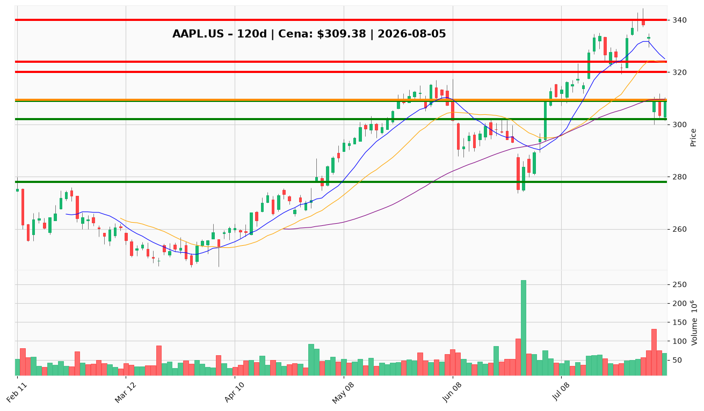

# AAPL.US (Apple) — Raport decyzyjny dla posiadacza pozycji

**Data analizy:** 2026-08-05 | **Ostatnia sesja:** 2026-08-04 | **Cena zamknięcia:** $309,38  
**Twoja cena nabycia:** $331,24 | **Niezrealizowana strata:** −6,6% (−$21,86/akcję)

---

## 1. 📌 BŁYSKAWICZNE PODSUMOWANIE

Apple (AAPL.US) znajduje się w krótkoterminowej korekcie wewnątrz długoterminowego trendu wzrostowego — po szczycie $340,08 (28 lipca) kurs spadł o ~9% w jednej sesji (31 lipca, wolumen 132,5M akcji) i stabilizuje się przy **$309,38**, dosłownie na SMA 50 ($309,61). Katalizatorem tygodnia jest reakcja rynku na wyniki FQ3 2026: rekordowy kwartał czerwcowy (+16,4% przychodów YoY, EPS +28,7%, FCF $31,9B) przy jednoczesnym rozczarowaniu forward guidance i zmianie CEO. Sentyment jest podzielony — narracja „buy the dip" kontra obawy o wzrost i strategię AI „wynajmuj, nie buduj". **Przy koszcie $331,24 i bieżącej $309,38: trzymaj pozycję — nie sprzedawaj panicznie na wsparciu SMA 50, nie dokupuj bez potwierdzenia technicznego powyżej $320; ustaw twardy alert na zamknięcie poniżej $302.**

---

## 2. ✅ CO ROBIĆ

▶ **TRZYMAJ pełną pozycję** – przy $309,38 i koszcie $331,24 – fundamenty nie uzasadniają wyjścia (rekordowy FQ3, marże netto 27,6%, TTM FCF ~$108B, buyback $25,1B/kwartał); techniczne wsparcie SMA 50 jest aktywne i niezłamane.

▶ **Ustaw twardy alert / stop na $302** – dzienne zamknięcie poniżej dolnego pasma Bollingera ($302,03) i dołka z 3 sierpnia ($301,32) – invalidacja średnioterminowej struktury; sygnał do redukcji 25–50% pozycji (zgodnie z Research Manager i Portfolio Manager).

▶ **Nie dokupuj przy bieżącej cenie** – warunki konserwatywnego wejścia (utrzymanie $302 + RSI >50 + ekspansja wolumenu na dniach wzrostowych) nie są spełnione; RSI 44,7, MACD histogram −3,52, odbicie 3–4 sierpnia na malejącym wolumenie.

▶ **DOKUP tylko przy przełamaniu $320–$322** – dzienne zamknięcie powyżej 10 EMA ($320,45) z rosnącym wolumenem – pierwszy konstruktywny sygnał krótkoterminowy; alternatywnie po udanym launchu iPhone we wrześniu z potwierdzeniem funkcji AI.

▶ **Przygotuj plan realizacji przy $324–$340** – cel średnioterminowy PM: $324 (środek Bollingera + VWMA $323,70), scenariusz byka $333–$340 (strefa ATH) po udanym wrześniowym katalizatorze; rozważ częściową realizację 20–30% przy $333+ jeśli pozycja wróci na plus.

▶ **Dostosuj wielkość pozycji do podwyższonej zmienności** – ATR $9,77 (+21% vs pre-crash); przy ewentualnym dokupie zmniejsz wielkość o ~20% vs poziomy z połowy lipca, aby utrzymać stałe ryzyko w USD.

▶ **Monitoruj wrześniowy launch iPhone** – pre-ordery, funkcje AI on-device, wykonanie nowego CEO; to główny katalizator re-ratingu w horyzoncie 2–4 miesięcy.

---

## 3. ❌ CZEGO NIE ROBIĆ

✖ **Nie sprzedawaj panicznie na SMA 50** – strata −6,6% od $331,24 to efekt guidance-driven selloff po rekordowym kwartale, nie fundamentalnego załamania; wyjście na $309 realizuje stratę dokładnie przy poziomie, który raport techniczny uznaje za kluczowe wsparcie — ostrzeżenie traci ważność po zamknięciu poniżej $302.

✖ **Nie dokupuj „na dołku" bez potwierdzenia** – RSI 44,7 (nie >50), MACD histogram pogłębia się (−3,52 przez 4 sesje), cena $14 poniżej VWMA ($323,70) — klasyczna dystrybucja instytucjonalna po crashu 31 lipca — ostrzeżenie traci ważność po zamknięciu powyżej $320 z wolumenem ≥100M akcji.

✖ **Nie używaj ciasnych stopów sprzed lipcowego crashu** – ATR wzrósł do $9,77; stop 1× ATR (~$15) od bieżącej ceny to ~$294,75, nie $325; ciasny stop na $320–$325 zostanie wybity przy normalnym szumie — ostrzeżenie traci ważność przy wejściu dokupowym powyżej $320 z szerszym buforem 1,5× ATR.

✖ **Nie ignoruj ryzyka guidance** – rynek wycenia forward expectations, nie backward results; kolejne cięcie guidance lub rozczarowujący launch we wrześniu przy P/E 34,8x i PEG 2,46 to asymetryczny downside — ostrzeżenie traci ważność po poprawie guidance lub silnym przyjęciu produktu.

✖ **Nie traktuj narracji AI jako gotowego katalizatora** – strategia „renting not building" tłumi ekspansję multiple; Apple traci na AI-led rally Nasdaq — ostrzeżenie traci ważność po wrześniu, jeśli on-device AI features re-ratingują Apple w narrację platformy AI z 2 mld urządzeń.

✖ **Nie dokładaj średniej w dół poniżej $302** – przełamanie dolnego pasma Bollingera otwiera drogę do $295 i $278 (SMA 200); averaging down w band-walk lower to klasyczny błąd — ostrzeżenie traci ważność tylko po szybkim odbiciu powyżej $310 z RSI >50 i rosnącym wolumenem.

---

## 4. 🎯 STRATEGIA INWESTOWANIA

### Trader (horyzont: dni–tygodnie)

- **Zarządzanie pozycją:** Trzymaj; nie dokupuj. Nie realizuj straty na wsparciu $309.
- **Trailing stop / alert:** $302 (dzienne zamknięcie) — redukcja 25–50% przy przebiciu.
- **Dokup:** Tylko przy zamknięciu powyżej $320–$322 z ekspansją wolumenu.
- **Cel:** $324 (mean reversion) → $333–$340 (odbicie do strefy pre-crash).
- **Breakeven:** Powrót do $331,24 wymaga wzrostu +7,1% od bieżącej ceny.

### Inwestor średnioterminowy (horyzont: 3–6 miesięcy)

- **Pozycja:** Utrzymaj pełną ekspozycję; nie zwiększaj bez potwierdzenia technicznego. Redukcja 25–50% tylko przy zamknięciu poniżej $302.
- **Cel:** $324 (bazowy PM, 2–4 tyg. przy potwierdzeniu); $333–$340 (bull case po wrześniowym launchu).
- **Stop / invalidacja:** Zamknięcie poniżej $302; następnie $295 (psychologiczny) i $278 (SMA 200).
- **Milestony:** RSI >50, reclaim VWMA $324, pre-order data iPhone, Foxconn revenue trend, brak dalszych cięć guidance.

### Inwestor długoterminowy (horyzont: 1–3 lata)

- **Akumulacja:** Trzymaj core; dokupy tylko przy potwierdzonym odbiciu ($320+ lub po udanym launchu); India >$10B sprzedaży rocznie, buyback ~$100B/rok i TTM FCF $108B wspierają tezę compoundera.
- **Cel:** Re-rating przy udanej strategii AI + ekspansja usług; strukturalny upside z dywidendy i buybacków.
- **Ryzyka strukturalne:** Dojrzały cykl iPhone, PEG 2,46, zmiana CEO, ryzyko antymonopolowe big tech, spór z OpenAI, inventory +88% YoY i current ratio ~1,0.

---

## 5. 🔔 LISTA ALERTÓW CENOWYCH

### Alerty dokupu / utrzymania (górne przebicia)

| Poziom | Kwota | Typ alertu | Znaczenie |
|--------|-------|------------|-----------|
| $320,00 | $320,00 | Przełamanie | 10 EMA — pierwszy sygnał odwrócenia momentum krótkoterminowego; trigger dokupu |
| $322,00 | $322,00 | Przełamanie | Strefa potwierdzenia agresywnego long (reclaim 10 EMA + wolumen) |
| $324,00 | $324,00 | Przełamanie | VWMA + środek Bollingera — sygnał absorpcji podaży z 31 lipca |
| $331,24 | $331,24 | Przełamanie | **Twój breakeven** — powrót na zero; rozważ trailing stop |
| $333,00 | $333,00 | Przełamanie | Strefa konsolidacji pre-crash — cel częściowej realizacji zysku |
| $340,08 | $340,08 | Przełamanie | ATH (28 lipca) — pełna realizacja scenariusza byka |

### Alerty ostrzegawcze / redukcji / wyjścia (dolne przebicia)

| Poziom | Kwota | Typ alertu | Znaczenie |
|--------|-------|------------|-----------|
| $305,00 | $305,00 | Przebicie w dół | Bufor 1,5% poniżej SMA 50 — pierwsze uszkodzenie średnioterminowej struktury |
| $302,00 | $302,00 | Przebicie w dół | **Dolne pasmo Bollingera** — twarda invalidacja; redukcja 25–50% |
| $295,00 | $295,00 | Przebicie w dół | Poziom psychologiczny — eskalacja spadku po utracie $302 |
| $278,25 | $278,25 | Przebicie w dół | SMA 200 — ostateczne wsparcie trendu długoterminowego (~10% poniżej bieżącej) |

**TOP 2 alerty absolutnego priorytetu:**

1. **Górny (dokup/utrzymanie):** $320,00 — dzienne zamknięcie powyżej 10 EMA z rosnącym wolumenem (≥100M akcji).
2. **Dolny (DANGER):** $302,00 — dzienne zamknięcie poniżej dolnego pasma Bollingera (redukcja 25–50% pozycji).

---

## 6. 📊 WARUNKI ZMIANY REKOMENDACJI

### Z TRZYMAJ → DOKUP

- Dzienne zamknięcie powyżej **$320–$322** z ekspansją wolumenu na dniach wzrostowych — reclaim 10 EMA.
- RSI powyżej **50** przy utrzymaniu SMA 50 ($309–$310) — potwierdzenie zmiany momentum.
- Reclaim **VWMA $324** na wolumenie — sygnał absorpcji podaży instytucjonalnej.
- Wrześniowy launch iPhone: silne pre-order data, pozytywne przyjęcie funkcji AI on-device — fundamentalna bramka skalowania.
- Poprawa forward guidance lub brak dalszych cięć outlooku — zmiana narracji sentymentowej.

### Z TRZYMAJ → REDUKUJ / SPRZEDAJ (częściowo)

- Zamknięcie poniżej **$302** na wolumenie — redukcja **25–50%** (Research Manager / Portfolio Manager).
- Odrzucenie przy **$320–$324** z RSI <50 i pogłębiającym się histogramem MACD — sygnał kontynuacji dystrybucji.
- Kolejne cięcie revenue guidance lub negatywny komentarz nowego CEO — fundamentalny downgrade.
- Rozczarowujący wrześniowy launch iPhone przy P/E 35x — asymetryczny downside.
- Zamknięcie poniżej **$305** (bufor pod SMA 50) przez ≥2 sesje — osłabienie średnioterminowej struktury.

### Z TRZYMAJ → PEŁNE WYJŚCIE

- Zamknięcie poniżej **$278** (SMA 200) — pełna invalidacja trendu długoterminowego w ramach tezy raportu.
- Kombinacja: $302 break + dalsze cięcie guidance + rozczarowujący launch + budowa inventory/receivables bez sell-through.
- RSI poniżej 30 z band-walk lower (zamknięcia poniżej dolnego pasma Bollingera przez ≥3 sesje) — scenariusz kontynuacji niedźwiedzia.
- Instrukcja sądowa w sporze z OpenAI lub eskalacja ryzyka regulacyjnego big tech z materialnym wpływem na model biznesowy.

---

## 7. WYKRESY TECHNICZNE

*Wykres: świece japońskie z wolumenem, SMA 10/20/50, poziomy wsparcia (zielone: $302 / $309 / $278) i oporu (czerwone: $320 / $324 / $340), bieżąca cena $309,38 (pomarańczowa). Poziom nabycia $331,24 powyżej bieżącej ceny — pozycja pod wodą o 6,6%, test kluczowego wsparcia SMA 50.*

---

**WERDYKT KOŃCOWY:** **TRZYMAJ** — utrzymaj pełną pozycję nabycia $331,24; nie sprzedawaj panicznie na wsparciu SMA 50 ($309). Nie dokupuj przy $309 bez potwierdzenia — trigger dokupu to zamknięcie powyżej $320–$322 z wolumenem. Ustaw twardy alert na **$302** (redukcja 25–50% przy przebiciu). Cel średnioterminowy $324, bull case $333–$340 po wrześniowym launchu iPhone. Powrót na breakeven ($331,24) wymaga +7,1% — realistyczny przy udanym katalizatorze, ale nie gwarantowany przy obecnym rozdźwięku guidance vs wyników.
