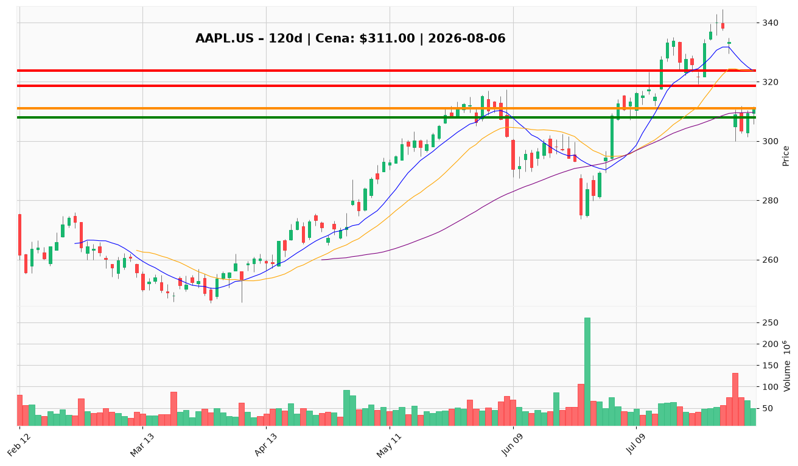

# AAPL.US — Ticket posiadacza (2026-08-06)

**Werdykt:** HOLD
**Horyzont:** swing (dni–tygodnie)
**Cena ref.:** $311.00

| | Poziom | Uwagi |
|---|--------|------|
| **Akcja teraz** | trzymaj | Nie dokupuj @ $311; utrzymaj 1,5094 akcji |
| **Stop-loss** | $308.00 | twardy — poniżej dołka z 3.08 i struktury odbicia |
| **TP1** | $318.73 | redukcja części (ok. 25–33%) przy 10 EMA / strefa $318–$323 |
| **TP2** | $323.72 | wyjście reszty przy powrocie do środkowej wstęgi Bollingera |

**Sizing / skala:** Pozycja zapisana: 1,5094 akcji @ $331,24 (niewielka strata ~−6,1% przy $311). Utrzymaj obecną alokację; nie zwiększaj ekspozycji. Przy podwyższonym ATR ($9,51) zmniejsz taktyczny sizing o ~20% względem normy.

**Warunek dokupu** (jeśli ADD): Brak — PM i Trader wyraźnie odradzają nowe longi @ $311 po spadku −7,5% (31.07) na 2,4× wolumenie.

**Unieważnienie / pełne wyjście:** Zamknięcie dzienne poniżej $309 przy rosnącym wolumenie — redukcja 25–33%; poniżej SL $308 otwiera ścieżkę do $301,64 (dolna wstęga) i $295.

**Dlaczego (1–2 zdania):** Fundamenty pozostają elite (przychody +16,4%, EPS +28,7%, buybacki $25,1B), ale setup po crashu jest sporny — odbicie na malejącym wolumenie i ujemny MACD sugerują dead-cat recovery. Przy P/E 35,7× i PEG 2,46 utrzymaj core, ale zarządzaj ryzykiem dyscyplinowanymi wyjściami.

**WERDYKT KOŃCOWY:** HOLD — trzymaj pozycję, ustaw alerty na SL $308 / TP1 $318,73 / TP2 $323,72; redukcja częściowa przy zamknięciu poniżej $309.

