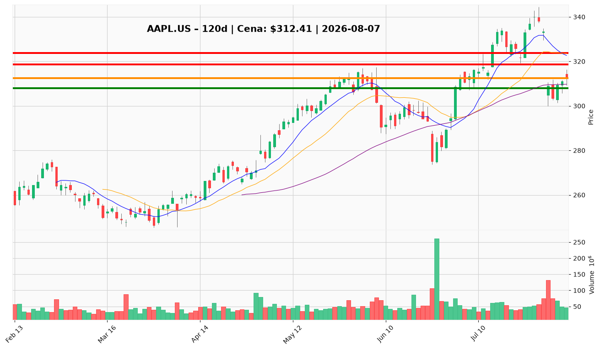

# AAPL.US — Ticket posiadacza (2026-08-07)

**Werdykt:** HOLD
**Horyzont:** swing (dni–tygodnie)
**Cena ref.:** $312.41

| | Poziom | Uwagi |
|---|--------|------|
| **Akcja teraz** | Trzymaj | Bez dokupu — momentum krótkoterminowe ujemne |
| **Stop-loss** | $308.00 | twardy — poniżej 50 SMA i strefy luki po wynikach |
| **TP1** | $318.73 | redukcja ~30% przy odzyskaniu 10 EMA |
| **TP2** | $323.72 | wyjście reszty / środek pasma Bollingera |

**Pozycja zapisana:** wejście $331.24 | SL $308.00 | TP1 $318.73 | TP2 $323.72

**Sizing / skala:** Utrzymaj obecną alokację. Nie dokupuj — MACD poniżej sygnału, cena pod 10 EMA. Ryzyko na pozycję: ~1,4% od ceny bieżącej do SL.

**Unieważnienie / pełne wyjście:** Zamknięcie dzienne poniżej $300.00 (dołek z 31.07) — pełny exit i ponowna ocena.

**Dlaczego (1–2 zdania):** Apple opublikował rekordowy kwartał (przychody $466,8 mld, FCF $107,7 mld), ale rynek zareagował wyprzedażą po wynikach z powodu obaw o marże (koszty pamięci) i spowolnienie usług. Technicznie cena trzyma się nad 50 SMA ($309,74), lecz momentum krótkoterminowe jest słabe — Hold z dyscypliną SL to optymalna strategia dla istniejącej pozycji.

**WERDYKT KOŃCOWY:** HOLD — trzymaj pozycję, nie dokupuj, pilnuj SL $308.00, realizuj częściowo przy $318.73 i $323.72.

