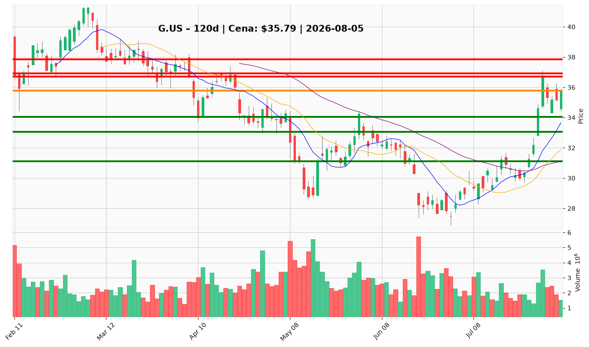

# G.US (Genpact) — Raport decyzyjny dla posiadacza pozycji

**Data analizy:** 2026-08-05 | **Ostatnia sesja:** 2026-08-04 | **Cena zamknięcia:** $35,79  
**Twoja cena nabycia:** $35,34 | **Niezrealizowany zysk:** +1,3%

---

## 1. 📌 BŁYSKAWICZNE PODSUMOWANIE

Genpact (G.US) przeżywa odbicie od dołka cyklu $26,85 (czerwiec 2026) do szczytu $36,71 (29 lipca), konsolidując przy **$35,79** — ok. 5,4% poniżej malejącej SMA 200 ($37,84). Krótko- i średnioterminowy trend jest wzrostowy (cena powyżej 10 EMA $34,04 i 50 SMA $31,11), lecz długoterminowa struktura pozostaje niedźwiedzia; MACD jest dodatni, ale histogram kurczy się, RSI 68,5 — blisko wykupienia. Katalizatorem tygodnia jest brak operacyjnych nagłówków firmowych; sentyment łagodnie pozytywny (2,8/5) wspierany listem Vulcan Value Partners o AI, bez kontraktów ani wyników. Wyniki Q2 2026 (~sierpień) to bramka tezy fundamentalnej. **Przy cenie nabycia $35,34 i bieżącej $35,79: trzymaj rdzeń pozycji, nie dokupuj w tej strefie — rozważ częściową realizację przy $36,93–$37,84.**

---

## 2. ✅ CO ROBIĆ

▶ **TRZYMAJ rdzeń pozycji** – przy $35,79 i koszcie $35,34 – fundamenty wspierają tezę (P/E 10,8x, ROE 23,1%, TTM FCF ~$712M, EPS Q1 +18% YoY); 36% spadku od szczytu grudniowego jest już w cenie.

▶ **Ustaw trailing stop / alert na $31,11** – zamknięcie dzienne poniżej 50 SMA – invalidacja średnioterminowej struktury odbicia; otwiera drogę do strefy $28–$31.

▶ **Rozważ redukcję 25–33% pozycji przy $36,93–$37,84** – górne pasmo Bollingera ($36,93), szczyt rally ($36,71) i SMA 200 ($37,84) bez potwierdzenia wolumenem ≥2,5M – zabezpieczenie zysku przed potencjalnym odrzuceniem przy wynikach Q2.

▶ **DOKUP tylko przy cofnięciu do $34,00–$34,50** – retest 10 EMA ($34,04) i strefy 1× ATR; RSI powyżej 55 i malejący wolumen w konsolidacji – preferowana strefa według analityka technicznego i tradera.

▶ **Alternatywny trigger dokupu: przełamanie $36,93** – dzienne zamknięcie powyżej górnego pasma Bollingera z wolumenem ≥2,5M akcji – potwierdzenie kontynuacji w stronę SMA 200 i $38–$40.

▶ **Czekaj na wyniki Q2 przed pełnym skalowaniem** – przed zwiększeniem pozycji ponad rdzeń zweryfuj: FCF powyżej zera (odwrócenie z -$55M w Q1), stabilizacja net debt (~$958M), guidance zgodny z konsensusowym EPS $4,48.

▶ **Monitoruj realizację zysków przy $42–$48** – bazowy cel 6–12 mies. (PM) przy częściowej dostawie forward EPS i ekspansji multiple do 10–12x.

---

## 3. ❌ CZEGO NIE ROBIĆ

✖ **Nie dokupuj przy $35,79 w środku konsolidacji** – cena między wsparciem $34,04 a oporem $36,93–$37,84 bez przewagi R/R; raport techniczny odradza pogonię – ostrzeżenie traci ważność po cofnięciu do $34–$34,50 lub potwierdzonym przełamaniu $36,93.

✖ **Nie sprzedawaj panicznie przed Q2** – TTM FCF ~$712M, dywidenda 2,13%, buyback ~6% market cap i beta 0,58 tworzą poduszkę wartościową; jeden negatywny kwartał FCF (-$55M) to swing working capital, nie bankructwo – ostrzeżenie traci ważność przy drugim kolejnym negatywnym FCF i ciągłych buybackach z długu.

✖ **Nie ignoruj stop-loss przy $31,11** – przełamanie 50 SMA (~13% poniżej bieżącej ceny) invaliduje tezę odbicia; historyczne spike wolumenu (4–5,7M) przy spadkach w lutym i czerwcu pokazują, że kolejna noga w dół może być gwałtowna – ostrzeżenie traci ważność tylko po ponownym zamknięciu powyżej $34 z rosnącym histogramem MACD.

✖ **Nie buduj pełnej pozycji przed Q2** – forward EPS $4,48 implikuje ~35% wzrost przy 7% wzrostu przychodów; PEG 1,16 = fair value, nie głęboka zaniedbanie; binarny event earnings wymaga dowodu – ostrzeżenie traci ważność po Q2 z FCF normalizacją i guidance potwierdzającym $4,48.

✖ **Nie traktuj narracji AI jako katalizatora operacyjnego** – Vulcan Value Partners i StockStory to sygnały sentymentu, nie kontrakty ani disclosed AI revenue; brak nagłówków firmowych w 7-dniowym oknie – ostrzeżenie traci ważność przy konkretnym katalizatorze (kontrakt, disclosed AI metrics, pozytywny komentarz zarządu przy wynikach).

✖ **Nie używaj ciasnych stopów poniżej 1× ATR ($1,35)** – przy ATR ~3,8% dziennego zakresu stop na $34,50 od wejścia $35,34 zostanie wybity przy normalnym szumie; użyj $31,11 jako twardej invalidacji struktury – ostrzeżenie traci ważność przy wejściu dokupowym w strefie $34–$34,50 z szerszym buforem.

---

## 4. 🎯 STRATEGIA INWESTOWANIA

### Trader (horyzont: dni–tygodnie)

- **Zarządzanie pozycją:** Trzymaj rdzeń; nie dokupuj w $35–$36. Częściowa realizacja 25–33% w strefie $36,93–$37,84.
- **Dokup:** Tylko przy cofnięciu do $34,00–$34,50 LUB przełamaniu $36,93 (zamknięcie dzienne, wolumen ≥2,5M).
- **Trailing stop:** $31,11 (50 SMA) — pełne wyjście przy zamknięciu poniżej.
- **Cel:** $37,84 (SMA 200) → $40,00 (strefa breakdownu) → $42–$48 (bazowy).

### Inwestor średnioterminowy (horyzont: 3–6 miesięcy)

- **Pozycja:** Utrzymaj rdzeń nabycia $35,34; redukcja taktyczna przy oporze $36,93–$37,84; dokup po Q2 przy potwierdzeniu FCF i guidance.
- **Cel:** $42–$48 (bazowy PM, 6–12 mies.).
- **Stop / invalidacja:** Zamknięcie poniżej $31,11; downgrade do redukcji przy drugim negatywnym FCF i buybackach z długu.
- **Milestony:** Q2 FCF >0, net debt stabilny/spadający, reclaim SMA 200 ($37,84), receivables normalizacja.

### Inwestor długoterminowy (horyzont: 1–3 lata)

- **Akumulacja:** Trzymaj core; dokupy w korektach do $34–$34,50 lub po udanym Q2; unikaj agresywnego dokupu powyżej $37,84 bez reclaim SMA 200.
- **Cel:** $48–$54 przy 12–15x forward EPS ($4,48) i materializacji tezy AI-enabled services.
- **Ryzyka strukturalne:** Konkurencja IT services (Accenture, Cognizant), goodwill $1,77B (tangible book ~$3,76/akcja), debt-funded buybacks, forward EPS wymagający dostawy ~35% wzrostu zysków.

---

## 5. 🔔 LISTA ALERTÓW CENOWYCH

### Alerty dokupu / utrzymania (górne przebicia)

| Poziom | Kwota | Typ alertu | Znaczenie |
|--------|-------|------------|-----------|
| $36,93 | $36,93 | Przełamanie | Górne pasmo Bollingera — dzienne zamknięcie + wolumen ≥2,5M = sygnał dokupu / utrzymania z celem SMA 200 |
| $37,84 | $37,84 | Przełamanie | SMA 200 — pierwsze potwierdzenie odwrócenia trendu długoterminowego |
| $38,50 | $38,50 | Przełamanie | Strefa poprzedniego breakdownu (luty 2026) — otwiera drogę do $40–$42 |
| $40,00 | $40,00 | Przełamanie | Psychologiczny próg + dawne wsparcie — sygnał kontynuacji re-ratingu |

### Alerty ostrzegawcze / redukcji / wyjścia (dolne przebicia)

| Poziom | Kwota | Typ alertu | Znaczenie |
|--------|-------|------------|-----------|
| $34,04 | $34,04 | Przebicie w dół | 10 EMA — pierwsze wsparcie; sygnał osłabienia momentum krótkoterminowego |
| $33,76 | $33,76 | Przebicie w dół | 1,5× ATR od $35,79 — ostrzeżenie przed głębszą korektą |
| $31,11 | $31,11 | Przebicie w dół | 50 SMA — **twarda invalidacja** średnioterminowej struktury odbicia |
| $28,25 | $28,25 | Przebicie w dół | Dołek czerwcowy — pełna porażka tezy recovery; scenariusz niedźwiedzia |

**TOP 2 alerty absolutnego priorytetu:**

1. **Górny (dokup/utrzymanie):** $36,93 — dzienne zamknięcie powyżej z wolumenem ≥2,5M akcji.
2. **Dolny (DANGER):** $31,11 — zamknięcie poniżej 50 SMA (invalidacja tezy odbicia).

---

## 6. 📊 WARUNKI ZMIANY REKOMENDACJI

### Z TRZYMAJ → DOKUP

- Cofnięcie do **$34,00–$34,50** z RSI >55 i dodatnim histogramem MACD — preferowana strefa dokupu.
- Dzienne zamknięcie powyżej **$36,93** przy wolumenie ≥2,5M — breakout entry.
- Q2 2026: FCF powyżej zera, net debt stabilny/spadający, guidance zgodny z EPS $4,48 — fundamentalna bramka skalowania.
- Utrzymanie powyżej **$37,84** (SMA 200) przez ≥3 sesje z rosnącym wolumenem na dniach wzrostowych.

### Z TRZYMAJ → REDUKUJ / SPRZEDAJ (częściowo)

- Cena w strefie **$36,93–$37,84** bez potwierdzenia wolumenem — redukcja 25–33% (taktyczna realizacja zysku).
- RSI divergence: nowy szczyt ceny powyżej $36,71 przy RSI <76 i kurczącym się histogramem MACD.
- Q2: drugi kolejny negatywny FCF przy kontynuacji buybacków z długu — downgrade do redukcji do benchmarku.
- Wolumen >4M akcji przy odrzuceniu z oporu $37–$38 — sygnatura dystrybucji (wzorzec luty/czerwiec).

### Z TRZYMAJ → PEŁNE WYJŚCIE

- Zamknięcie poniżej **$31,11** (50 SMA) na rosnącym wolumenie — pełna invalidacja struktury odbicia.
- Q2 miss: negatywny FCF po raz drugi + cięcie forward EPS poniżej $4,00 + wzrost net debt.
- Zamknięcie poniżej **$28,25** (dołek czerwcowy) — powrót do trendu spadkowego strukturalnego.
- Brak FCF normalizacji przez 2+ kwartały przy rosnącym zadłużeniu i insider selling bez cluster buying.

---

## 7. WYKRESY TECHNICZNE

*Wykres: świece japońskie z wolumenem, SMA 10/20/50, poziomy wsparcia (zielone: $34,04 / $33,05 / $31,12) i oporu (czerwone: $36,71 / $36,93 / $37,84), bieżąca cena $35,79 (pomarańczowa). Poziom nabycia $35,34 w strefie konsolidacji $35–$36.*

---

**WERDYKT KOŃCOWY:** **TRZYMAJ** — utrzymaj rdzeń pozycji nabycia $35,34; nie dokupuj w bieżącej strefie $35,79. Rozważ redukcję 25–33% przy $36,93–$37,84 bez potwierdzenia wolumenem. Dokup tylko przy cofnięciu do $34–$34,50 lub przełamaniu $36,93. Ustaw twardy alert na $31,11 (50 SMA) jako warunek pełnego wyjścia. Wyniki Q2 2026 to bramka do skalowania lub redukcji — nie sprzedawaj panicznie przed drukiem, ale nie ignoruj ryzyka negatywnego FCF i rosnącego zadłużenia.
