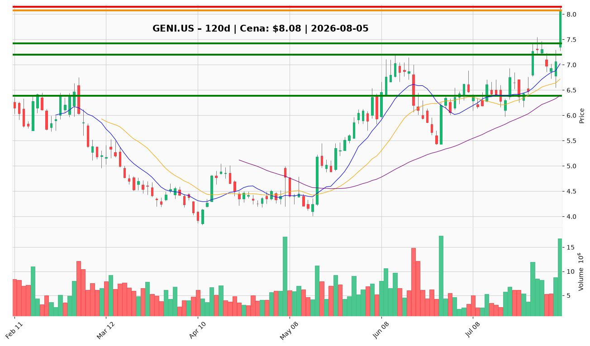

# GENI.US — Raport decyzyjny dla nowej pozycji

**Data analizy:** 2026-08-05 | **Ostatnia sesja:** 2026-08-04 | **Cena zamknięcia:** $8.08 (+14,3%)

---

## 1. 📌 BŁYSKAWICZNE PODSUMOWANIE

Genius Sports (GENI.US) notuje się po agresywnym odbiciu od dołka cyklu $3,87 (kwiecień 2026) do obecnych **$8,08**, po sesji z wolumenem 16,8 mln akcji — najwyższym od lutyowego krachu. Krótkoterminowy trend jest wyraźnie wzrostowy (cena powyżej 10 EMA $7,12, 50 SMA $6,39 i 200 SMA $7,42), lecz RSI na poziomie **71,3** sygnalizuje wykupienie, a spółka wciąż jest o **~34%** poniżej poziomu sprzed roku. Katalizatorem tygodnia jest przełamanie 200 SMA na wysokim wolumenie, bez jednak bezpośrednich nagłówków firmowych — sentyment sektorowy (AI w sporcie, NFL-ESPN) jest łagodnie pozytywny, ale drugorzędny. **To nie jest dobry moment na wejście po cenie bieżącej** — stosunek ryzyka do zysku przy $8+ jest niekorzystny; lepsze wejście wymaga korekty lub potwierdzenia przełamania.

---

## 2. ✅ CO ROBIĆ

▶ **Ustaw alert cenowy na strefę $7,20–$7,45** – gdy cena cofnie się do konfluencji 10 EMA ($7,12) i 200 SMA ($7,42) z RSI spadającym do 55–62 – to preferowana strefa wejścia według analityka technicznego i tradera; ryzyko/zysk znacznie lepsze niż przy $8,08.

▶ **Ustaw alert przełamania na $8,15** – gdy pojawią się dwa kolejne zamknięcia powyżej $8,15 przy wolumenie ≥8 mln – alternatywny trigger wejścia potwierdzający kontynuację wybicia z 4 sierpnia.

▶ **Rozpocznij pozycję starterową (25–33% planowanej ekspozycji)** – przy pierwszym udanym retescie $7,42 (200 SMA) z pozytywnym histogramem MACD – skalowanie stopniowe zamiast jednorazowego wejścia redukuje ryzyko fałszywego odbicia.

▶ **Dodaj drugą transzę (kolejne 33%)** – tylko gdy cena utrzyma się powyżej 50 SMA ($6,39) i MACD pozostaje dodatni – potwierdzenie średnioterminowej struktury wzrostowej.

▶ **Ustal stop-loss na 2× ATR (~$0,96) poniżej ceny wejścia** – np. przy wejściu $7,30 stop na ~$6,34; twarda invalidacja przy zamknięciu poniżej **$6,39** (50 SMA).

▶ **Monitoruj wyniki Q4 2026** – przychody zbliżające się do $240M+, marża brutto stabilnie >25%, brak utrzymującego się spalania FCF – warunki do zwiększenia pozycji ponad rozmiar starterowy.

▶ **Zaplanuj częściową realizację zysków przy $9,00 i $10,00** – poziomy oporu z konsolidacji styczniowej 2026 i psychologiczny próg; zabezpieczenie zysku w strefie podaży.

---

## 3. ❌ CZEGO NIE ROBIĆ

✖ **Nie kupuj po cenie $8,00+** – RSI 71,3, cena +13,5% powyżej 10 EMA i +14,3% w jednej sesji to strefa słabego R/R; raport techniczny wyraźnie odradza pogonię za ruchem – ostrzeżenie traci ważność po korekcie do $7,20–$7,45 lub potwierdzonym przełamaniu $8,15.

✖ **Nie buduj pełnej pozycji w jednej transzy** – beta 1,88 i ATR $0,48 (~5,9% dzienny zakres) oznaczają, że normalna zmienność może wymieść tight stop; skalowanie chroni przed fałszywym sygnałem – ostrzeżenie traci ważność po dwóch transzach zrealizowanych zgodnie z planem.

✖ **Nie ignoruj jakości wyników finansowych** – TTM strata netto ~$159M, spalenie FCF $84M w Q1 2026, spadek deferred revenue z $97M do $75M QoQ; forward P/E 8,3x opiera się na oczekiwaniach ($0,97 EPS), nie dostarczonych zyskach GAAP – ostrzeżenie traci ważność po Q4 z przychodami $240M+ i marżą >25%.

✖ **Nie opieraj decyzji na sentymencie sektorowym** – brak nagłówków firmowych GENI w tym tygodniu; tematy AI-w-sporcie i NFL-ESPN są drugorzędne bez kontraktu lub komentarza zarządu – ostrzeżenie traci ważność przy konkretnym katalizatorze firmowym (kontrakt, wyniki, partnerstwo).

✖ **Nie używaj ciasnych stopów poniżej 1× ATR** – przy ATR $0,48 stop na $7,60 od wejścia $8,08 zostanie wybity przy normalnym szumie – ostrzeżenie traci ważność przy wejściu w strefie $7,20–$7,45 z szerszym buforem.

✖ **Nie traktuj jednego dnia wolumenu jako gwarancji odwrócenia** – 16,8M akcji może oznaczać climax kupna; obserwuj, czy wolumen follow-through utrzymuje się >8M, czy spada poniżej 5M – ostrzeżenie traci ważność przy trzech kolejnych sesjach wzrostowych z wolumenem >8M.

---

## 4. 🎯 STRATEGIA INWESTOWANIA

### Trader (horyzont: dni–tygodnie)

- **Wejście:** $7,20–$7,45 (retest 10 EMA/200 SMA) LUB przełamanie $8,15 (2 zamknięcia, wolumen ≥8M). Nie przy $8,08.
- **Cel:** $8,15 → $9,00 (półka styczniowa 2026).
- **Stop-loss:** 1,5× ATR (~$7,36 od $8,08) dla agresywnego; 2× ATR (~$7,12) standardowy; twardy stop $6,39 (50 SMA).

### Inwestor średnioterminowy (horyzont: 3–6 miesięcy)

- **Wejście:** Skalowanie w strefie $7,20–$7,45; pierwsza transza na retescie $7,42, druga po utrzymaniu powyżej $6,39.
- **Cel:** $9,00 (near-term), $10,00 (psychologiczny), re-wycena przy forward P/E 12–13x → $12+.
- **Stop-loss:** Zamknięcie poniżej $6,39 (invalidacja odbicia); monitoring cash <$150M bez ścieżki do Q4.
- **Milestony:** Q4 2026 przychody $240M+, marża brutto >25%, FCF nie spalający się bez sezonowego offsetu, liczba akcji stabilna ~258M.

### Inwestor długoterminowy (horyzont: 1–3 lata)

- **Akumulacja:** Stopniowe budowanie pozycji w korektach do $6,39–$7,45; unikanie pogoni za $8+; pełna ekspozycja dopiero po udanym Q4 2026 i utrzymaniu powyżej $7,42.
- **Cel:** $12–$13+ przy materializacji forward EPS $0,97 i re-ratingu; teza oparta na duopolu danych oficjalnych, wzroście przychodów ~30% YoY i niskim zadłużeniu (~$31M).
- **Ryzyka strukturalne:** Utrzymujące się straty GAAP, rozcieńczenie akcji (+9% YoY), goodwill/intangibles 47% aktywów, zmienność marż (7,5%–28,4%), historia nieudanych odbić (szczyt $11,37 w grudniu 2025).

---

## 5. 🔔 LISTA ALERTÓW CENOWYCH

### Alerty wejścia (górne przebicia — sygnały BUY)

| Poziom | Kwota | Typ alertu | Znaczenie |
|--------|-------|------------|-----------|
| $8,15 | $8,15 | Przełamanie | Szczyt intraday 4 sierpnia; 2 zamknięcia + wolumen ≥8M = potwierdzenie kontynuacji wybicia |
| $8,50 | $8,50 | Przełamanie | Początek strefy podaży $8,50–$9,00 (konsolidacja styczniowa 2026) |
| $9,00 | $9,00 | Przełamanie | Kluczowy opór — półka styczniowa; przełamanie otwiera drogę do $10,00 |
| $10,00 | $10,00 | Przełamanie | Poziom psychologiczny + dawne wsparcie; zamyka re-rating w stronę $12+ |

### Alerty ostrzegawcze (dolne przebicia — sygnały DANGER)

| Poziom | Kwota | Typ alertu | Znaczenie |
|--------|-------|------------|-----------|
| $7,42 | $7,42 | Przebicie w dół | 200 SMA — utrata kluczowego filtra długoterminowego; invalidacja przejęcia średniej |
| $7,12 | $7,12 | Przebicie w dół | 10 EMA — pierwsze wsparcie pullbacku; sygnał osłabienia momentum |
| $6,39 | $6,39 | Przebicie w dół | 50 SMA — twarda invalidacja tezy odbicia; strefa docelowa niedźwiedzia $5,40–$6,00 |
| $5,40 | $5,40 | Przebicie w dół | Dołek z 25 czerwca — całkowita porażka tezy recovery |

**TOP 2 alerty absolutnego priorytetu:**

1. **Górny (BUY):** $8,15 — dwa kolejne zamknięcia powyżej z wolumenem ≥8M akcji.
2. **Dolny (DANGER):** $6,39 — zamknięcie poniżej 50 SMA (invalidacja odbicia).

---

## 6. 📊 WARUNKI ZMIANY REKOMENDACJI

### Z CZEKAJ → KUPUJ (BUY)

- Korekta do strefy **$7,20–$7,45** z RSI 55–62 i dodatnim histogramem MACD — preferowane wejście.
- **Dwa kolejne zamknięcia powyżej $8,15** przy wolumenie ≥8M — alternatywne wejście breakout.
- Q4 2026: przychody **$240M+**, marża brutto **>25%**, FCF bez utrzymującego się spalania — fundamentalne potwierdzenie tezy forward earnings.
- Utrzymanie powyżej $7,42 (200 SMA) przez ≥5 sesji z rosnącym wolumenem na dniach wzrostowych.

### Z CZEKAJ → UNIKAJ (AVOID)

- Zamknięcie poniżej **$6,39** (50 SMA) na rosnącym wolumenie — wznowienie trendu spadkowego.
- Q4 2026 przychody poniżej **$220M** lub marża brutto ponownie <15%.
- Cash spadający poniżej **$150M** bez widocznej ścieżki do sezonowego odbicia Q4.
- RSI divergence + nowy szczyt ceny przy kurczącym się histogramie MACD przy $8,50+.
- Przyspieszone rozcieńczenie akcji powyżej 258M bez uzasadnienia biznesowego.

---

## 7. WYKRESY TECHNICZNE

*Wykres: świece japońskie z wolumenem, SMA 10/20/50, poziomy wsparcia (zielone: $7,20 / $7,42 / $6,39) i oporu (czerwone: $8,15 / $9,00 / $10,00), bieżąca cena $8,08 (pomarańczowa).*

---

**WERDYKT KOŃCOWY:** **CZEKAJ** — nie inicjuj pozycji długiej po $8,08; ustaw alerty na strefę $7,20–$7,45 (preferowane wejście) lub potwierdzone przełamanie $8,15 i buduj pozycję stopniowo dopiero po poprawie stosunku ryzyka do zysku.
