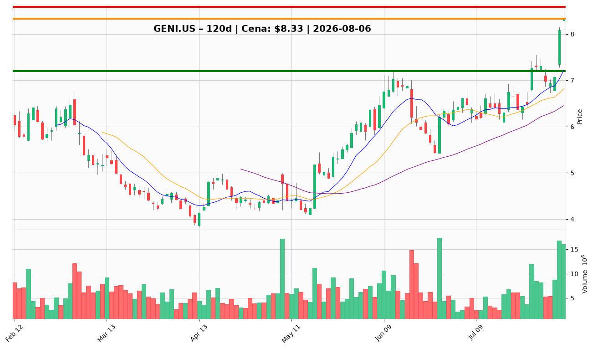

# GENI.US — Ticket posiadacza (2026-08-06)

**Werdykt:** HOLD  
**Horyzont:** swing (dni–tygodnie)  
**Cena ref.:** $8.33

| | Poziom | Uwagi |
|---|--------|------|
| **Akcja teraz** | Trzymaj | Nie dokupuj przy $8.33; redukuj 25–50% (15–30 akcji) przy $8.50–$8.59 |
| **Stop-loss** | $7.20 | twardy — poniżej konsolidacji lipcowej i klastra 10 EMA |
| **TP1** | $8.59 | redukcja części (szczyt intraday 5 sie / opór luki) |
| **TP2** | $9.00 | wyjście reszty (opór psychologiczny / strefa wsparcia sprzed spadku) |

**Sizing / skala:** Pozycja zapisana: 60 akcji @ $8.28 (zysk ~+0,6% vs cena ref.). Przy TP1 sprzedaj 15–30 szt.; reszta (30–45 szt.) z SL $7.20 w kierunku TP2.

**Warunek dokupu** (jeśli ADD): Brak — nie dokupuj po +20% w trzy sesje przy RSI 73,4 i zamknięciu powyżej górnej wstęgi Bollingera. Ewentualny limit dokupu dopiero przy pullbacku do $7.45 (strefa $7.40–$7.50).

**Unieważnienie / pełne wyjście:** Dzienne zamknięcie poniżej $6.45 (50 SMA) unieważnia tezę swing recovery — wyjdź z całej pozostałej pozycji.

**Dlaczego (1–2 zdania):** GENI jest przeciążony technicznie w strefie podaży $8.50–$8.59 bez potwierdzenia fundamentalnego infleksji EPS; PM i trader zgodnie: nie gonić ceny, obcinać część w oporze i chronić rdzeń stop-em $7.20.

**WERDYKT KOŃCOWY:** HOLD — utrzymaj zredukowany rdzeń, sprzedaj 25–50% w strefie $8.50–$8.59, nie dokupuj przy obecnej cenie.

