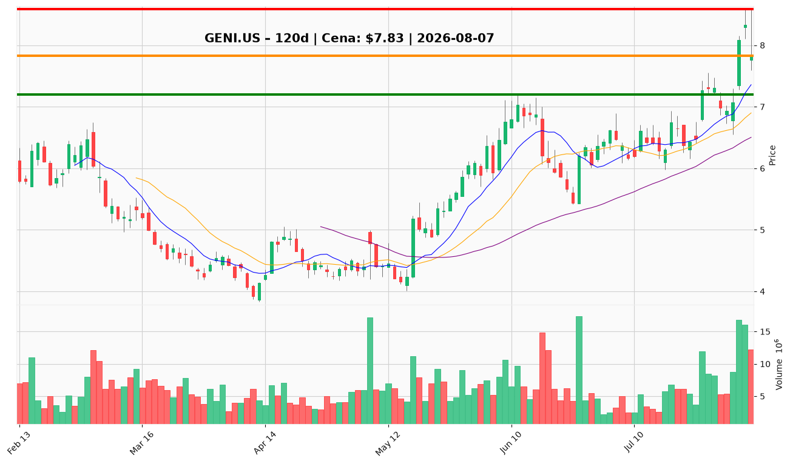

# GENI.US — Ticket posiadacza (2026-08-07)

**Werdykt:** HOLD
**Horyzont:** swing (dni–tygodnie)
**Cena ref.:** $7.83

| | Poziom | Uwagi |
|---|--------|------|
| **Akcja teraz** | Trzymaj pełną pozycję | Nie dokupuj — poczekaj na reclaim $8.33 |
| **Stop-loss** | $7.20 | Twardy — poniżej dołka breakoutu (Aug 4) |
| **TP1** | $8.59 | Sprzedaj 50% — high z Aug 5 |
| **TP2** | $9.00 | Wyjście z reszty |

**Pozycja zapisana:** wejście $8.28 · SL $7.20 · TP1 $8.59 · TP2 $9.00

**Sizing / skala:** Pełna istniejąca pozycja. Ryzyko ~13% od wejścia do SL. Po TP1 podnieś SL do breakeven ($8.28).

**Warunek dokupu:** Brak — nie dokupuj przy $7.83. ADD tylko po reclaim $8.33 na volume lub dip do $7.50–7.60 ze stop $7.20.

**Unieważnienie / pełne wyjście:** Dzienne zamknięcie poniżej $7.20 → EXIT całej pozycji.

**Dlaczego (1–2 zdania):** Q2 revenue +65%, podniesiona guidance i breakout powyżej 200 SMA na wysokim volume potwierdzają tezę. Pullback Aug 6 (−5.9%) to normalna konsolidacja po earnings — MACD nadal bullish, RSI 63.5. Forward P/E ~7.3x przy 65% wzrostu revenue uzasadnia trzymanie do TP.

**WERDYKT KOŃCOWY:** HOLD — trzymaj z SL $7.20, realizuj 50% przy $8.59, reszta przy $9.00. Nie dokupuj bez reclaim $8.33.

