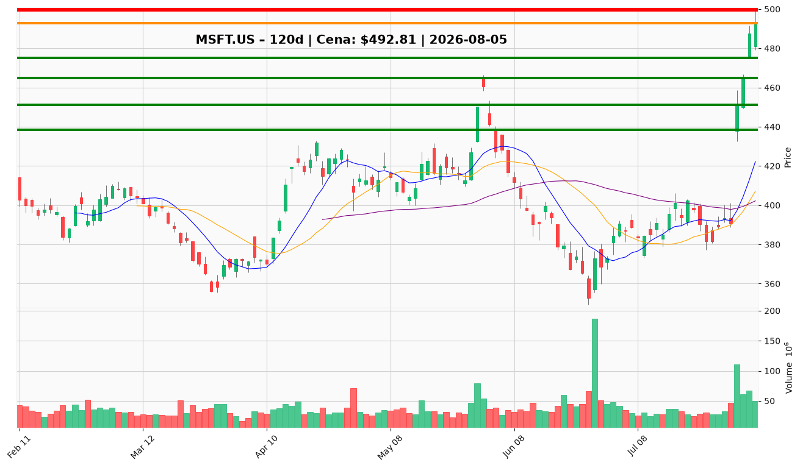

# MSFT.US (Microsoft) — Raport decyzyjny dla posiadacza pozycji

**Data analizy:** 2026-08-05 | **Ostatnia sesja:** 2026-08-04 | **Cena zamknięcia:** $492,81  
**Twoja cena nabycia:** $498,63 | **Niezrealizowana strata:** −1,2%

---

## 1. 📌 BŁYSKAWICZNE PODSUMOWANIE

Microsoft (MSFT.US) zakończył gwałtowne odbicie V-kształtne od dołka cyklu $352,83 (25 czerwca 2026) do $492,81 — rally +39,7% w ~6 tygodni, w tym gap +15,5% 30 lipca na wolumenie 110,2M akcji (3,7× średniej) po wynikach Q2 FY2026 (przychody $90,0B, +17,8% YoY; Microsoft Cloud $59,3B, +27% YoY). Cena powyżej wszystkich kluczowych średnich (10 EMA $438,39; 50 SMA $402,21; 200 SMA $432,06), lecz RSI 79,0 i cena +3% powyżej górnego pasma Bollingera sygnalizują wykupienie i podwyższone ryzyko korekty. Katalizatorem tygodnia jest potwierdzenie monetyzacji AI (OpenAI, Copilot) i przełamanie pivotu cup-base $466,32; sentyment jest zdecydowanie byczy, choć Michael Burry zamknął pozycję, a insiderzy nie kupują na $493. **Przy nabyciu $498,63 i bieżącej $492,81: trzymaj rdzeń pozycji — nie sprzedawaj panicznie w strefie nabycia; nie dokupuj na obecnym poziomie; czekaj na cofnięcie do $464–475 lub częściową realizację dopiero po zamknięciu powyżej $500 przy wolumenie >50M.**

---

## 2. ✅ CO ROBIĆ

▶ **TRZYMAJ rdzeń pozycji** – przy $492,81 i koszcie $498,63 – teza fundamentalna jest potwierdzona (marża operacyjna 45,1%, OCF +30% YoY do $55,4B, bilans forteca: $442B equity, $76,7B gotówki); strata −1,2% to szum w kontekście ATR $17,04 (3,4% ceny).

▶ **Nie dokupuj przy $492–493** – RSI 79, cena powyżej górnego Bollingera i asymetryczny R/R (+3,5% do $510 vs. −5,8% do $464) — jednomyślne ostrzeżenie techniczne i zarządzającego portfela.

▶ **DOKUP tylko przy cofnięciu do $464–475** – retest zamknięcia 31 lipca ($464,72) i pivotu cup-base ($466,32); wdroż 40–50% planowanej alokacji dokupowej; reszta przy $438 (10 EMA), jeśli 200 SMA ($432) utrzyma się.

▶ **Rozważ częściową realizację 10–15% przy zamknięciu powyżej $500** – wolumen >50M akcji; cel strefa $510–530 (dawny opór sierpień–wrzesień 2025); zabezpieczenie zysku bez porzucania rdzenia.

▶ **Ustaw strukturalny stop na $432 (200 SMA)** – dzienne zamknięcie poniżej na wolumenie invaliduje tezę odwrócenia breakoutu; to linia w piasku dla całej pozycji.

▶ **Redukcja 25–30% przy przełamaniu $451 na rosnącym wolumenie** – wypełnienie gapu 30 lipca (−8,5% od bieżącej ceny); sygnał osłabienia momentum instytucjonalnego.

▶ **Monitoruj trigger fundamentalny** – spowolnienie wzrostu Azure + rosnący stosunek capex/przychody w kolejnym kwartale = downgrade do redukcji niezależnie od ceny.

---

## 3. ❌ CZEGO NIE ROBIĆ

✖ **Nie sprzedawaj panicznie przy $492–493** – strata −1,2% od $498,63 to normalny szum po parabolicznym rally +26,2% w 4 sesje; fundamenty (cloud +27%, marże 45%) nie uzasadniają wyjścia ze stratą w strefie nabycia — ostrzeżenie traci ważność przy przełamaniu $451 na wolumenie lub spadku Azure poniżej oczekiwań.

✖ **Nie dokupuj „żeby się wyrównać”** – uśrednianie w dół w strefie wykupienia (RSI 79) pogarsza profil ryzyka; lepsza geometria wejścia to $464–475 — ostrzeżenie traci ważność po zdrowym cofnięciu z RSI <65 i utrzymaniu $475.

✖ **Nie ignoruj stop-loss przy $432** – 200 SMA to poziom invalidacji całej tezy breakoutu; utrzymanie „bo to Microsoft” bez zdefiniowanego wyjścia to zarządzanie emocjami, nie kapitałem — ostrzeżenie traci ważność tylko po ponownym zamknięciu powyżej $475 z rosnącym histogramem MACD.

✖ **Nie realizuj zysku przed $500 bez powodu** – konsensus (Trader, PM, Neutral Risk) odradza redukcję powyżej $490 bez problemu koncentracji portfela; przy koszcie $498,63 nie masz zysku do zabezpieczenia — ostrzeżenie traci ważność przy RSI divergence lub spadku wolumenu na nowych szczytach.

✖ **Nie traktuj wyjścia Burry'ego jako sygnału sprzedaży** – brak klastra insider buying, ale też brak panic selling; rutynowe sprzedaże 10b5-1 (Nadella $75M we wrześniu 2025) — ostrzeżenie traci ważność przy klastrze zakupów insiderów lub cięciu forward EPS.

✖ **Nie używaj ciasnych stopów poniżej 1× ATR ($17)** – stop na $476 (1× ATR) zostanie wybity przy normalnym szumie po breakoutcie; taktyczny stop dla swingów: poniżej $464,72 (31 lipca) lub $475 (dołek 3 sierpnia) — ostrzeżenie traci ważność przy wejściu dokupowym w strefie $464–475 z szerszym buforem 1,5× ATR (~$26).

---

## 4. 🎯 STRATEGIA INWESTOWANIA

### Trader (horyzont: dni–tygodnie)

- **Zarządzanie pozycją:** Trzymaj rdzeń; nie dokupuj w $492–493. Częściowa realizacja 10–15% dopiero po zamknięciu >$500 (wolumen >50M).
- **Dokup:** Tylko przy cofnięciu do $464–475 (40–50% planowanej alokacji) lub głębszym $438 przy utrzymaniu $432.
- **Trailing stop:** $475 (dołek 3 sierpnia) dla taktycznych dokupów; $432 (200 SMA) dla rdzenia pozycji.
- **Cel:** $510 (pierwszy opór) → $520–530 (strefa podaży 2025).

### Inwestor średnioterminowy (horyzont: 3–6 miesięcy)

- **Pozycja:** Utrzymaj rdzeń nabycia $498,63; nie redukuj bez triggera ($451 lub koncentracja portfela). Dokup w korekcie $464–475.
- **Cel:** $510–530 (PM, 6–12 mies.); forward P/E 21x implikuje EPS $23,47.
- **Stop / invalidacja:** Zamknięcie poniżej $432 (200 SMA); redukcja 25–30% przy $451.
- **Milestony:** Utrzymanie $475+, zamknięcie >$500 na wolumenie, szczyt capex i infleksja FCF.

### Inwestor długoterminowy (horyzont: 1–3 lata)

- **Akumulacja:** Trzymaj core; dokupy w korektach do $464–475 i $438; unikaj agresywnego dokupu powyżej $500 bez potwierdzenia kontynuacji.
- **Cel:** Powrót do szczytu $553,72 i dalszy wzrost przy monetyzacji AI (Copilot, Azure AI, OpenAI).
- **Ryzyka strukturalne:** Capex $35,8B/kwartał vs. FCF $19,6B, P/E 27,2x, FCF yield ~1,8%, ryzyko łańcucha dostaw (transceivery optyczne z Chin), regulacje antymonopolowe.

---

## 5. 🔔 LISTA ALERTÓW CENOWYCH

### Alerty dokupu / utrzymania (górne przebicia)

| Poziom | Kwota | Typ alertu | Znaczenie |
|--------|-------|------------|-----------|
| $499,44 | $499,44 | Przełamanie | Szczyt intraday 4 sierpnia — pierwszy test oporu; utrzymanie = kontynuacja momentum |
| $500,00 | $500,00 | Przełamanie | Psychologiczny próg; dzienne zamknięcie + wolumen >50M = trigger częściowej realizacji 10–15% |
| $510,00 | $510,00 | Przełamanie | Pierwsza strefa oporu technicznego (+3,5% od bieżącej); cel realizacji zysku |
| $530,00 | $530,00 | Przełamanie | Strefa konsolidacji sierpień–wrzesień 2025; pełniejsza realizacja zysku |

### Alerty ostrzegawcze / redukcji / wyjścia (dolne przebicia)

| Poziom | Kwota | Typ alertu | Znaczenie |
|--------|-------|------------|-----------|
| $475,00 | $475,00 | Przebicie w dół | Dołek 3 sierpnia (S1) — pierwsze wsparcie; osłabienie momentum krótkoterminowego |
| $464,72 | $464,72 | Przebicie w dół | Zamknięcie 31 lipca / pivot cup-base — strefa preferowanego dokupu staje się testem |
| $451,10 | $451,10 | Przebicie w dół | Strefa gapu 30 lipca — **redukcja 25–30%** pozycji |
| $432,06 | $432,06 | Przebicie w dół | 200 SMA — **twarda invalidacja** tezy breakoutu; pełne wyjście z taktycznych dokupów |

**TOP 2 alerty absolutnego priorytetu:**

1. **Górny (utrzymanie/realizacja):** $500,00 — dzienne zamknięcie powyżej z wolumenem >50M akcji (trigger częściowej realizacji i potwierdzenie kontynuacji).
2. **Dolny (DANGER):** $451,10 — przełamanie strefy gapu 30 lipca na rosnącym wolumenie (redukcja 25–30% pozycji).

---

## 6. 📊 WARUNKI ZMIANY REKOMENDACJI

### Z TRZYMAJ → DOKUP

- Cofnięcie do **$464–475** z RSI schładzającym się do 60–65 i utrzymaniem wolumenu poniżej średniej — preferowana strefa dokupu (40–50% planowanej alokacji).
- Głębszy retest **$438** (10 EMA) przy utrzymaniu **$432** (200 SMA) — druga transza dokupu.
- Dzienne zamknięcie powyżej **$500** z wolumenem >50M + kontynuacja przez ≥3 sesje — agresywny scenariusz dokupu na potwierdzeniu (tylko dla kapitału taktycznego, max 25–30% planowanej alokacji).
- Kolejny kwartał: Azure utrzymuje tempo wzrostu ≥25% YoY + sygnały szczytu capex — fundamentalna bramka skalowania.

### Z TRZYMAJ → REDUKUJ / SPRZEDAJ (częściowo)

- Zamknięcie powyżej **$500** przy wolumenie >50M — częściowa realizacja 10–15% (zabezpieczenie zysku w strefie $510–530).
- Przełamanie **$451** na rosnącym wolumenie — redukcja 25–30% (wypełnienie gapu).
- RSI divergence: nowy szczyt ceny powyżej $499,44 przy RSI <75 i kurczącym się histogramie MACD.
- Kwartał: spowolnienie Azure + rosnący capex/revenue — downgrade niezależnie od ceny.
- Koncentracja MSFT w portfelu przekracza limity ryzyka (>15–20% portfela) — redukcja do wagi benchmarkowej.

### Z TRZYMAJ → PEŁNE WYJŚCIE

- Dzienne zamknięcie poniżej **$432** (200 SMA) na rosnącym wolumenie — pełna invalidacja tezy odwrócenia trendu.
- Przełamanie **$407** (środek Bollingera) — głęboka korekta; scenariusz powrotu do zakresu $380–400.
- Dwa kolejne kwartały: spadający Azure + rosnący capex + kompresja FCF yield — fundamentalne złamanie tezy AI.
- Makro: gwałtowna reprycja multiple tech (Fed, koncentracja indeksów 28,7% top-7 VOO) z łamaniem $451 i $432 sekwencyjnie.

---

## 7. WYKRESY TECHNICZNE

*Wykres: świece japońskie z wolumenem, SMA 10/20/50, poziomy wsparcia (zielone: $475 / $464,72 / $451,10 / $438,39) i oporu (czerwone: $499,44 / $500 / $510 / $530), bieżąca cena $492,81 (pomarańczowa). Poziom nabycia $498,63 tuż powyżej bieżącej ceny — w strefie wykupienia po parabolicznym rally.*

---

**WERDYKT KOŃCOWY:** **TRZYMAJ** — utrzymaj rdzeń pozycji nabycia $498,63; strata −1,2% to szum techniczny, nie sygnał wyjścia. Nie dokupuj w strefie $492–493 (RSI 79, wykupienie). Nie sprzedawaj panicznie — teza AI i wyniki Q2 FY2026 ją potwierdzają. Częściowa realizacja 10–15% dopiero po zamknięciu >$500 (wolumen >50M). Dokup planuj przy cofnięciu do $464–475. Twardy alert redukcji: $451 (gap fill, −25–30%). Stop strukturalny: $432 (200 SMA). Microsoft to forteca fundamentalna w fazie inwestycyjnej capex — dyscyplina cenowa ważniejsza niż reakcja emocjonalna na −1,2%.
