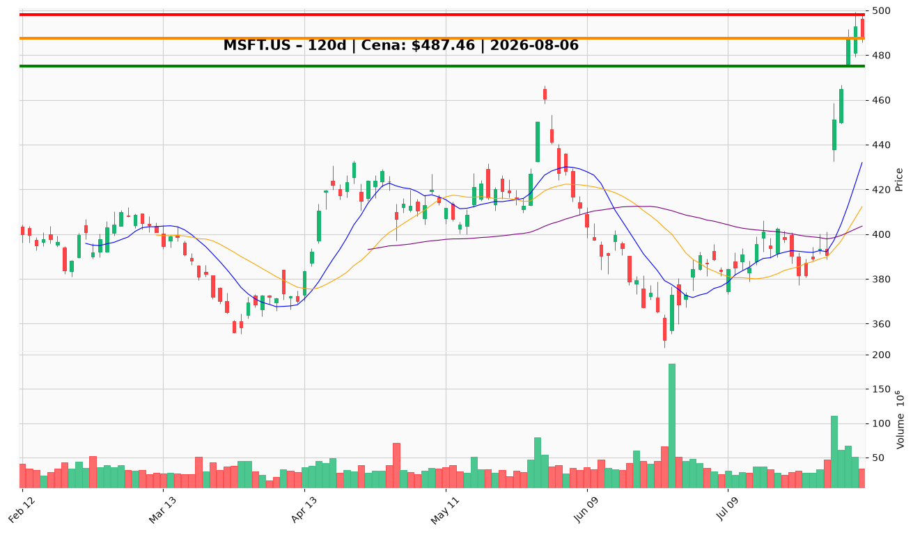

# MSFT.US — Ticket posiadacza (2026-08-06)

**Werdykt:** HOLD
**Horyzont:** position (tygodnie–miesiące)
**Cena ref.:** $487.46

| | Poziom | Uwagi |
|---|--------|------|
| **Akcja teraz** | trzymaj | Utrzymaj rdzeń; rozważ redukcję 15–20% przy obecnej ekstensji |
| **Stop-loss** | $475.00 | trailing — poniżej dołka z 3.08; twardy strukturalny $440.00 |
| **TP1** | $498.00 | redukcja części (strefa Bollinger / psychologiczne $500) |
| **TP2** | $518.00 | wyjście reszty przy ponownym wzroście wolumenu >45M |

**Sizing / skala:** Pozycja zapisana: 0,6016 akcji @ $498,63 (nienaliczona strata ~−2,2% vs cena ref.). Nie dokupuj powyżej $480; nowy kapitał tylko limit buy @ $458,00 (strefa $451–465).

**Warunek dokupu** (jeśli ADD): Limit buy @ $458,00 po pullbacku do strefy akumulacji $451–465 — nie przy $487.

**Unieważnienie / pełne wyjście:** Dwa kolejne zamknięcia poniżej $475 przy wolumenie >50M lub wypełnienie luki poniżej $451 → defensywny Hold/Underweight; pełne wyjście przy przebiciu $440 (200 SMA).

**Dlaczego (1–2 zdania):** Rekordowy Q4 FY2026 i breakout po wynikach wspierają tezę AI/cloud, ale RSI 76,1 i +24,7% w 6 sesjach czynią gonienie powyżej $480 nieakceptowalnym. PM i Trader zgodnie: trzymaj rdzeń, przytnij ekspozycję w ekstensji, zarządzaj ryzykiem trailingiem $475.

**WERDYKT KOŃCOWY:** HOLD — utrzymaj rdzeń 0,6016 akcji, rozważ sprzedaż 15–20% przy $487–498, alerty SL $475 / TP1 $498 / TP2 $518; dokup tylko na pullbacku do $458.

