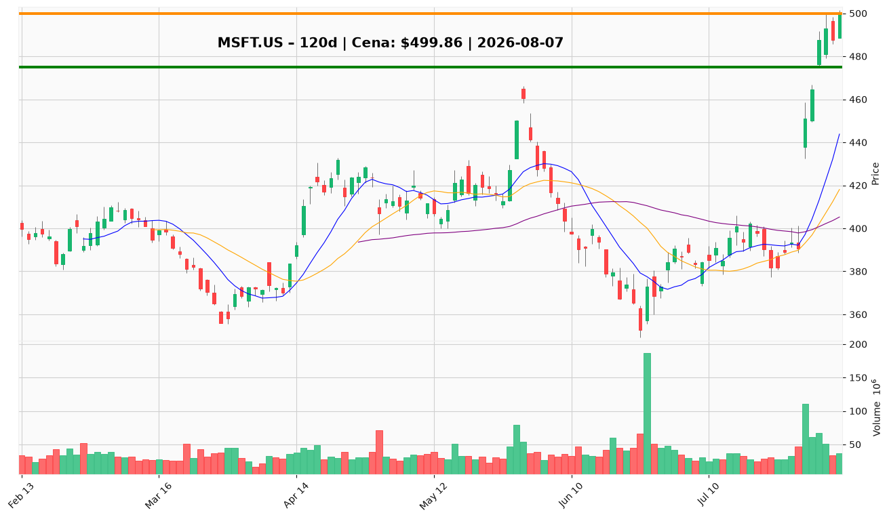

# MSFT.US — Ticket posiadacza (2026-08-07)

**Werdykt:** HOLD
**Horyzont:** pozycja (tygodnie–miesiące)
**Cena ref.:** $499.86

| | Poziom | Uwagi |
|---|--------|------|
| **Akcja teraz** | Trzymaj | Brak dokupu powyżej $502 — RSI 78, odrzucenie przy $501.56 |
| **Stop-loss** | $475.00 | Twardy — poniżej dołka z 03.08, unieważnia strukturę po wynikach |
| **TP1** | $518.00 | Redukcja 25–30% pozycji |
| **TP2** | $540.00 | Wyjście z reszty / trailing stop |

**Pozycja zapisana:** wejście $498.63 | SL $475.00 | TP1 $518.00 | TP2 $540.00

**Sizing / skala:** Utrzymaj obecną alokację. Przy RSI >70 nie dokupuj. Po przebiciu $502 na wolumenie — rozważ podniesienie SL do $485 (trailing).

**Warunek dokupu:** Tylko przy pullbacku do $485–$490 z RSI <65. Nie dodawaj na obecnym poziomie.

**Unieważnienie / pełne wyjście:** Dzienne zamknięcie poniżej $475.00 — pełny exit.

**Dlaczego (1–2 zdania):** Wyniki Q4 potwierdziły tezę AI/Azure (rekordowy skok +15% w dniu wyników, FCF $19.6B mimo wysokiego capex). Technicznie trend wzrostowy, ale RSI 78 i opór przy $502 przemawiają za trzymaniem z dyscypliną, nie dokupowaniem.

**WERDYKT KOŃCOWY:** HOLD — trzymaj pozycję z SL $475, realizuj częściowo przy $518, cel końcowy $540.

