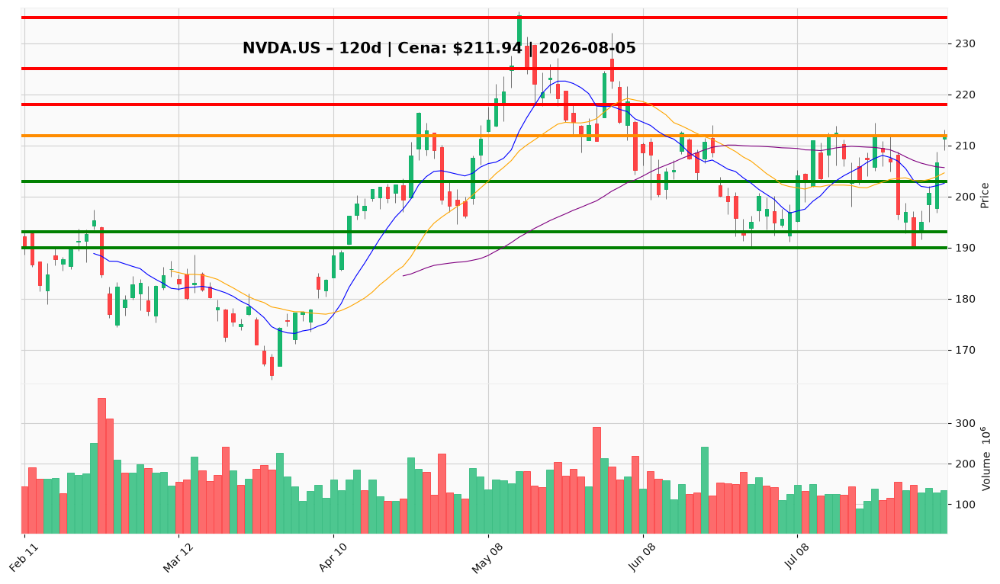

# NVDA.US (NVIDIA) — Raport decyzyjny dla posiadacza pozycji

**Data analizy:** 2026-08-05 | **Ostatnia sesja:** 2026-08-04 | **Cena zamknięcia:** $211,94  
**Twoja cena nabycia:** $209,92 | **Niezrealizowany zysk:** +1,0%

---

## 1. 📌 BŁYSKAWICZNE PODSUMOWANIE

NVIDIA (NVDA.US) odbija się po dołku lipcowym $190,01, handlując przy **$211,94** — ok. 10% poniżej szczytu cyklu $235,47 (maj 2026), lecz 30% powyżej marcowego dołka $164,98. Krótkoterminowy trend jest wzrostowy (cena powyżej 10 EMA $203,26 i 50 SMA $205,65), MACD histogram właśnie przeszedł na dodatni (+0,52), RSI 56,94 — neutralnie-bykowy z przestrzenią do $65–70. Katalizatorem tygodnia jest ogłoszenie SpaceX o budowie centrów danych wyłącznie na chipach NVIDIA (Musk, 5 sierpnia), wsparte komentarzem AWS o zablokowanym popycie do 2028 i partnerstwem Volta ($10B na platformie DSX). Sentyment jest przyspieszająco byczy, lecz cena siedzi tuż pod oporem $217–$218 (górne pasmo Bollingera). **Przy koszcie $209,92 i bieżącej $211,94: trzymaj rdzeń pozycji, nie dokupuj w tej strefie — rozważ częściową realizację 15–25% przy $217–$218 bez potwierdzenia wolumenem.**

---

## 2. ✅ CO ROBIĆ

▶ **TRZYMAJ rdzeń pozycji** – przy $211,94 i koszcie $209,92 – teza AI-infrastruktury pozostaje nienaruszona (Q1 FY2027: przychody $81,6B +85% r/r, marża brutto 75%, FCF $48,6B/kwartał); PM i trader rekomendują Overweight/Hold, nie sprzedaż.

▶ **Ustaw trailing stop / alert na $203** – zamknięcie dzienne poniżej klastra 10 EMA / VWMA / 50 SMA ($203–$206) – invalidacja odbicia sierpniowego; otwiera drogę do strefy $190–$195.

▶ **Rozważ redukcję 15–25% pozycji przy $217–$218** – górne pasmo Bollingera ($217,23), lokalny szczyt intraday $213,06 i opór techniczny bez przełamania z rosnącym wolumenem – taktyczna realizacja zysku przed potencjalnym odrzuceniem po katalizatorze SpaceX.

▶ **DOKUP tylko przy cofnięciu do $205–$208** – retest 50 SMA ($205,65), 10 EMA ($203,26) i VWMA ($203,00); RSI powyżej 55 i dodatni histogram MACD – preferowana strefa według analityka technicznego, tradera i Research Managera.

▶ **Alternatywny trigger dokupu: przełamanie $218** – dzienne zamknięcie powyżej górnego pasma Bollingera z rosnącym wolumenem (≥150M akcji) – potwierdzenie breakoutu w stronę $225–$230.

▶ **Podnieś stop do $200 po zamknięciu powyżej $218** – 1,5× ATR ($7,69) poniżej nowego wejścia; twarda invalidacja tezy odbicia poniżej $200 (otwarcie sierpnia $197,69).

▶ **Monitoruj realizację zysków przy $225–$230 i $235–$236** – cele pośrednie (2× ATR) i pełne wznowienie trendu (szczyt maja) wymagają potwierdzenia wolumenem i wyników kwartalnych.

---

## 3. ❌ CZEGO NIE ROBIĆ

✖ **Nie dokupuj przy $211–$213 w środku odbicia** – cena 2,5% poniżej oporu $217–$218 po headline'owym skoku SpaceX; raport techniczny przypisuje 30% prawdopodobieństwa konsolidacji $203–$218 przez tygodnie – ostrzeżenie traci ważność po cofnięciu do $205–$208 lub potwierdzonym przełamaniu $218.

✖ **Nie sprzedawaj panicznie po katalizatorze SpaceX** – fundamenty wspierają tezę (forward P/E 16,4x, PEG 0,57, FCF $48,6B/kwartał); short Burry'ego jest pod wodą, AMD beat uznany za „nie wyjątkowy” – ostrzeżenie traci ważność przy przełamaniu $203 na rosnącym wolumenie lub negatywnym guidance capex hyperscalerów.

✖ **Nie ignoruj stop-loss przy $203** – utrata klastra średnich (10 EMA / 50 SMA / VWMA) po V-kształtnym odbiciu z $190 invaliduje krótkoterminową tezę; lipcowy spadek $212→$190 w 2 tygodnie pokazuje, że korekta 10% jest realna – ostrzeżenie traci ważność tylko po ponownym zamknięciu powyżej $206 z dodatnim histogramem MACD.

✖ **Nie traktuj narracji SpaceX/AWS/Volta jako zdarzenia przychodowego** – to sygnały popytu wieloletniego, nie kwartalne wpisy do P&L; analityk newsowy ostrzega przed wyczerpaniem katalizatora – ostrzeżenie traci ważność przy ujawnieniu warunków kontraktu lub potwierdzeniu capex w wynikach hyperscalerów.

✖ **Nie buduj pełnej pozycji na szczycie odbicia** – MACD line wciąż ujemna (−0,40), cena 10% poniżej szczytu maja, sentyment rozciągnięty po headline'u Muska; beta 2,22 oznacza ±3,6% dzienne ruchy jako normę – ostrzeżenie traci ważność po przełamaniu $235–$236 z rosnącym wolumenem i potwierdzeniem forward EPS $12,89.

✖ **Nie używaj zbyt ciasnych stopów poniżej 1× ATR ($7,69)** – stop na $207 od wejścia $209,92 zostanie wybity przy normalnym szumie; użyj $203 jako pierwszej invalidacji struktury, $200 jako twardej – ostrzeżenie traci ważność przy wejściu dokupowym w strefie $205–$208 z szerszym buforem.

---

## 4. 🎯 STRATEGIA INWESTOWANIA

### Trader (horyzont: dni–tygodnie)

- **Zarządzanie pozycją:** Trzymaj rdzeń nabycia $209,92; nie dokupuj w $211–$213. Częściowa realizacja 15–25% w strefie $217–$218.
- **Dokup:** Tylko przy cofnięciu do $205–$208 LUB przełamaniu $218 (zamknięcie dzienne, wolumen ≥150M).
- **Trailing stop:** $203 (klastra średnich) — pełne wyjście przy zamknięciu poniżej; twardy stop $200.
- **Cel:** $217–$218 (BB upper) → $225–$230 (2× ATR) → $235–$236 (szczyt cyklu).

### Inwestor średnioterminowy (horyzont: 3–6 miesięcy)

- **Pozycja:** Utrzymaj rdzeń $209,92; redukcja taktyczna przy oporze $217–$218; dokup po cofnięciu do $205–$208 lub po reclaim $235.
- **Cel:** $225–$230 (bazowy PM, 2–4 tygodnie przy scenariuszu byczym 60%) → $235–$236 (pełne wznowienie trendu).
- **Stop / invalidacja:** Zamknięcie poniżej $203; downgrade do redukcji przy wzroście inventory/revenue powyżej 35% bez wzrostu przychodów.
- **Milestony:** Guidance capex hyperscalerów (Meta, AMZN, MSFT, GOOG), inventory days, marża datacenter, przełamanie $218 z wolumenem.

### Inwestor długoterminowy (horyzont: 1–3 lata)

- **Akumulacja:** Trzymaj core; dokupy w korektach do $205–$208 lub po reclaim $235–$236; unikaj agresywnego dokupu powyżej $218 bez potwierdzenia breakoutu.
- **Cel:** $235–$236+ przy dostawie forward EPS $12,89 i kontynuacji tezy platformy AI (DSX, CUDA, ekosystem).
- **Ryzyka strukturalne:** Koncentracja klientów hyperscaler, inventory +128% r/r, insider selling (~$407M Stevens), beta 2,22 i koncentracja indeksowa (VOO 28,7% w 7 akcjach), presja capex (Meta FCF −91%).

---

## 5. 🔔 LISTA ALERTÓW CENOWYCH

### Alerty dokupu / utrzymania (górne przebicia)

| Poziom | Kwota | Typ alertu | Znaczenie |
|--------|-------|------------|-----------|
| $218,00 | $218,00 | Przełamanie | Górne pasmo Bollingera — dzienne zamknięcie + wolumen ≥150M = sygnał dokupu / utrzymania z celem $225–$230 |
| $225,00 | $225,00 | Przełamanie | Strefa konsolidacji majowej — potwierdzenie kontynuacji rally |
| $230,00 | $230,00 | Przełamanie | Cel 2× ATR — sygnał silnego momentum |
| $235,47 | $235,47 | Przełamanie | Szczyt cyklu (14 maja) — pełne wznowienie trendu wzrostowego |

### Alerty ostrzegawcze / redukcji / wyjścia (dolne przebicia)

| Poziom | Kwota | Typ alertu | Znaczenie |
|--------|-------|------------|-----------|
| $206,00 | $206,00 | Przebicie w dół | 50 SMA ($205,65) — pierwsze osłabienie odbicia sierpniowego |
| $203,00 | $203,00 | Przebicie w dół | Klastra 10 EMA / VWMA / 50 SMA — **twarda invalidacja** krótkoterminowej struktury |
| $200,00 | $200,00 | Przebicie w dół | 1,5× ATR od $211,94 — invalidacja tezy odbicia; otwarcie sierpnia $197,69 |
| $190,01 | $190,01 | Przebicie w dół | Dołek lipcowy — pełna porażka tezy recovery; scenariusz niedźwiedzia do SMA 200 ($193) |

**TOP 2 alerty absolutnego priorytetu:**

1. **Górny (dokup/utrzymanie):** $218,00 — dzienne zamknięcie powyżej górnego pasma Bollingera z wolumenem ≥150M akcji.
2. **Dolny (DANGER):** $203,00 — zamknięcie poniżej klastra 10 EMA / VWMA / 50 SMA (invalidacja odbicia sierpniowego).

---

## 6. 📊 WARUNKI ZMIANY REKOMENDACJI

### Z TRZYMAJ → DOKUP

- Cofnięcie do **$205–$208** z RSI >55 i dodatnim histogramem MACD — preferowana strefa dokupu (50 SMA / 10 EMA / VWMA).
- Dzienne zamknięcie powyżej **$218** przy wolumenie ≥150M — breakout entry z celem $225–$230.
- Hyperscaler capex guidance potwierdzający wydatki AI (AMZN, MSFT, GOOG, META) bez cięć — fundamentalna bramka skalowania.
- Utrzymanie powyżej **$225** przez ≥3 sesje z rosnącym wolumenem na dniach wzrostowych — upgrade do pełnego Overweight.

### Z TRZYMAJ → REDUKUJ / SPRZEDAJ (częściowo)

- Cena w strefie **$217–$218** bez potwierdzenia wolumenem — redukcja 15–25% (taktyczna realizacja zysku po katalizatorze SpaceX).
- Odrzucenie z $218 na 2 kolejnych sesjach z rosnącym wolumenem — sygnatura dystrybucji (wzorzec lipcowy $212→$190).
- Wzrost inventory/revenue powyżej 35% bez wzrostu przychodów kwartalnych — downgrade do redukcji.
- Meta lub inny top-5 klient kieruje capex AI w dół — trigger automatycznej redukcji 25–33%.

### Z TRZYMAJ → PEŁNE WYJŚCIE

- Zamknięcie poniżej **$203** (klastra średnich) na rosnącym wolumenie — pełna invalidacja struktury odbicia.
- Zamknięcie poniżej **$200** — twarda invalidacja tezy sierpniowego V-odbicia.
- Zamknięcie poniżej **$190,01** (dołek lipcowy) — powrót do głębszej korekty w stronę SMA 200 ($193).
- Guidance marży datacenter poniżej 70% lub wzrost inventory days bez matching revenue — konwersja debaty w drawdown.

---

## 7. WYKRESY TECHNICZNE

*Wykres: świece japońskie z wolumenem, SMA 10/20/50, poziomy wsparcia (zielone: $203 / $190 / $193) i oporu (czerwone: $218 / $225 / $235), bieżąca cena $211,94 (pomarańczowa). Poziom nabycia $209,92 w strefie odbicia po dołku lipcowym $190,01.*

---

**WERDYKT KOŃCOWY:** **TRZYMAJ** — utrzymaj rdzeń pozycji nabycia $209,92; nie dokupuj w bieżącej strefie $211–$213 tuż pod oporem $217–$218. Rozważ redukcję 15–25% przy $217–$218 bez potwierdzenia wolumenem. Dokup tylko przy cofnięciu do $205–$208 lub przełamaniu $218. Ustaw trailing stop na $203 (klastra średnich) i twardy alert na $200 jako warunek pełnego wyjścia. Teza AI-infrastruktury pozostaje Overweight, lecz cierpliwość przy wejściu jest kluczowa — nie gon za headline'em SpaceX w strefie oporu.
