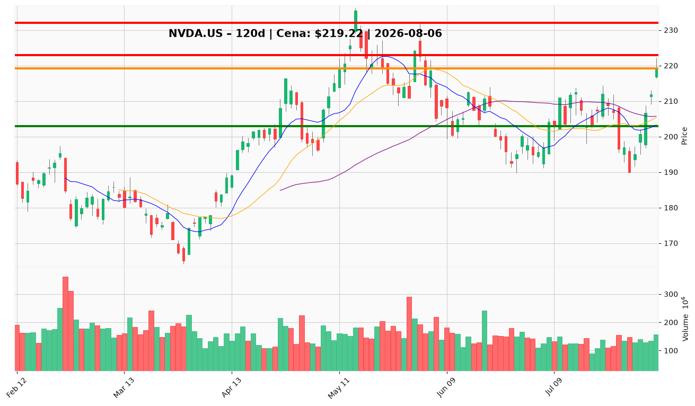

# NVDA.US — Ticket posiadacza (2026-08-06)

**Werdykt:** HOLD
**Horyzont:** swing (dni–tygodnie)
**Cena ref.:** $219.22

| | Poziom | Uwagi |
|---|--------|------|
| **Akcja teraz** | trzymaj | Nie dokupuj powyżej $215–220; utrzymaj 1,4291 akcji |
| **Stop-loss** | $203.00 | twardy — zamknięcie dzienne poniżej 50 SMA / 2× ATR |
| **TP1** | $223.00 | redukcja części (ok. 25–50%) przy lokalnym szczycie |
| **TP2** | $232.00 | wyjście reszty w strefie cyklu ($230–236) |

**Sizing / skala:** Pozycja zapisana: 1,4291 akcji @ $209,92 (zysk nienaliczony ~+4,4%). Nie zwiększaj ekspozycji przy obecnej cenie; nowe ryzyko max 0,5–1% kapitału przed wynikami 26.08.

**Warunek dokupu** (jeśli ADD): Limit buy @ $206,50 w strefie pullbacku $205–208 (konfluencja 50 SMA / 10 EMA) — tylko po cofnięciu, nie przy $219.

**Unieważnienie / pełne wyjście:** Zamknięcie dzienne poniężej $203 przy ujemnym histogramie MACD i RSI < 50, lub jednoczesne cięcia capex hyperscalerów w guidance.

**Dlaczego (1–2 zdania):** Fundamenty i trend wzrostowy pozostają silne (Overweight), ale po +6,1% w 3 sesjach cena siedzi przy górnej wstędze Bollingera — ryzyko krótkoterminowe asymetryczne w dół przed earnings 26.08. PM i Trader zgodnie: trzymaj istniejącą pozycję, nie gon za ceną.

**WERDYKT KOŃCOWY:** HOLD — utrzymaj pozycję, ustaw alerty na SL $203 / TP1 $223 / TP2 $232; dokup tylko na pullbacku do $206,50.

