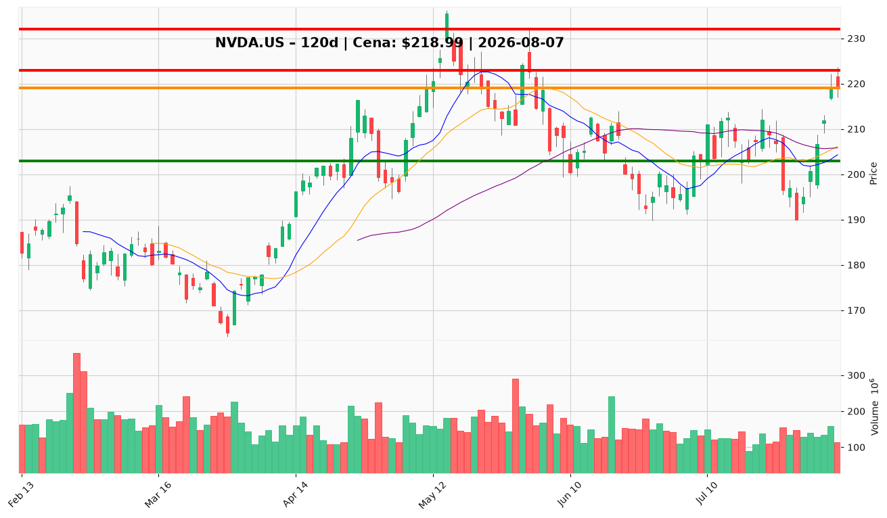

# NVDA.US — Ticket posiadacza (2026-08-07)

**Werdykt:** HOLD
**Horyzont:** swing (dni–tygodnie)
**Cena ref.:** $218.99

| | Poziom | Uwagi |
|---|--------|------|
| **Akcja teraz** | Trzymaj | Pozycja zapisana: wejście $209.92 (+4,3% niezrealiz.) |
| **Stop-loss** | $203.00 | twardy — poniżej 50 SMA i wsparcia odbicia z lipca |
| **TP1** | $223.00 | redukcja 25% przy oporze (górna wstęga Bollingera) |
| **TP2** | $232.00 | wyjście reszty — okolice poprzedniego szczytu |

**Sizing / skala:** Utrzymaj pełną pozycję. Po TP1: sprzedaj 25%, resztę prowadź z trailing stop na $210.
**Warunek dokupu:** Brak dokupu przy $219 — niekorzystny R/R. Ewentualny dokup tylko przy pullbacku do $206–208 (retest 10-EMA).
**Unieważnienie / pełne wyjście:** Zamknięcie dzienne poniżej $203.00 → wyjście z całej pozycji.

**Dlaczego (1–2 zdania):** Odbicie V-shape z $190 potwierdzone przez crossover MACD i powrót powyżej 50 SMA; fundamenty (marża 63%, forward P/E 17×) i przepływ newsów (deal SharonAI $4,9B) wspierają trend. Przy $219 cena jest 2% od TP1 i 7% od SL — nie ma sensu dokupywać ani wychodzić przedpremierowo; trzymaj z dyscypliną SL/TP.

**WERDYKT KOŃCOWY:** HOLD — trzymaj pozycję z SL $203, realizuj 25% przy $223, resztę przy $232.

