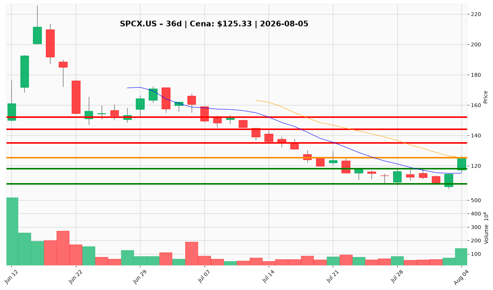

# Rekomendacje inwestycyjne: SPCX.US (SpaceX)

**Data analizy:** 2026-08-05  
**Cena zamknięcia:** $125,33 (sesja 2026-08-04)  
**Kontekst inwestora:** Brak pozycji; rozważane wejście z dźwignią 1:5

---

## 1. 📌 BŁYSKAWICZNE PODSUMOWANIE

SPCX.US notuje $125,33 po odbiciu z dołka $108,37 (−49% od szczytu IPO $211,39), lecz średnioterminowy trend pozostaje spadkowy — cena jest 13% poniżej SMA 50 ($144). Główny katalizator tygodnia to pierwszy raport kwartalny po IPO: przychody +92% YoY do $7,8 mld (powyżej konsensusu), ale akcja spadła ~10% w sesji po wynikach — klasyczny „beat and sell” w otoczeniu obaw o capex, lock-up i wycenę 137,6× forward P/E. Sentyment jest gwałtownie podzielony: byki wskazują na Starlink, partnerstwo z Nvidia i AI; niedźwiedzie na ujemnym FCF (−$9,1 mld/kw.), nadchodzący lock-up i niepotwierdzone odwrócenie techniczne. **To nie jest dobry moment na pełnowymiarowe wejście** — zwłaszcza z dźwignią 1:5; konsensus raportu to HOLD / Underweight z oczekiwaniem na potwierdzenie powyżej $144.

---

## 2. ✅ CO ROBIĆ

▶ **Pozostań poza rynkiem przy $125** – brak nowej ekspozycji core – Raport jednogłośnie odradza inicjację longa po beat-and-drop; cena siedzi dokładnie na środkowej wstędze Bollingera bez potwierdzenia trendu.

▶ **Ustaw alert na pullback do $118** – wejście wyłącznie po testzie 10 EMA + VWMA ($118,21 / $118,46) – To jedyny poziom wejścia akceptowany przez analityka technicznego dla doświadczonych traderów; lepszy stosunek ryzyka do nagrody niż kupno „w połowie” odbicia.

▶ **Przy ewentualnym wejściu: stop-loss poniżej $108** – zamknięcie dzienne < $108 – Twarda invalidacja tezy odbicia; poniżej tego poziomu otwiera się strefa $99–$105 (dolna wstęga Bollingera).

▶ **Ogranicz ryzyko do max 0,2–0,4% kapitału przy dźwigni 1:5** – przy ATR ~$9,63 (~7,7% dziennego ruchu) – Przy 5× dźwigni ruch ~2% przeciwko pozycji zużywa ~10% depozytu; standardowe 1–2% ryzyka portfela bez dźwigni przy 5× oznacza ekstremalne ryzyko likwidacji.

▶ **Śledź kalendarz lock-up i kolejne filingi insiderów** – przed każdą decyzją o wejściu – Nadchodzące wygaśnięcie lock-up to strukturalne ryzyko podaży niezależne od wyników; raport traktuje to jako główny driver sprzedaży.

▶ **Czekaj na ≥2 z 4 triggerów upgrade** – m.in. 3 zamknięcia > $144 przy wolumenie ≥80 mln – Portfolio Manager i Research Manager wymagają obiektywnego potwierdzenia przed akumulacją core; bez tego HOLD pozostaje właściwy.

▶ **Rozważ wejście dopiero po zamknięciu powyżej $144** – 3 kolejne sesje, wolumen ≥80 mln – Przełamanie SMA 50 z wolumenem to kluczowy sygnał, że odbicie nie jest dead-cat bounce.

---

## 3. ❌ CZEGO NIE ROBIĆ

✖ **Kupowanie „na newsie” po wynikach przy $125** – rynek już zdyskontował beat; wycena 137,6× forward P/E na ujemnym zysku – Ostrzeżenie traci ważność dopiero po trzech zamknięciach powyżej $144 z rosnącym wolumenem.

✖ **Używanie dźwigni 1:5 jako domyślnej strategii wejścia** – dzienne wahania ~8% × 5 = potencjalna likwidacja w 1–2 sesjach – Dopuszczalne tylko przy ekstremalnie małym rozmiarze i twardym stopie; przy braku pozycji lepiej w ogóle nie używać dźwigni.

✖ **Ignorowanie lock-up expiry** – insiderzy i wcześni inwestorzy mogą zwiększyć podaż niezależnie od fundamentów – Ostrzeżenie traci ważność, gdy lock-up minie bez sustained selling poniżej $108.

✖ **Shortowanie przy $125 po odbiciu** – wolumen 140,6 mln na zielonej świecy (+9,4%) sygnalizuje absorpcję podaży – Ostrzeżenie traci ważność po odrzuceniu przy $144–$152 z rosnącym wolumenem spadkowym.

✖ **Traktowanie MACD+ i RSI 45,8 jako potwierdzenia odwrócenia** – to jedna sesja po miesiącu spadków; tylko 36 sesji historii cenowej – Ostrzeżenie traci ważność po drugim tygodniu dodatniego histogramu MACD i wyższym dołku cenowym.

✖ **Pełna alokacja na narrację AI/Nvidia/Starlink** – capex 215% przychodów, FCF −$9,1 mld/kw., R&D 75% revenue – Ostrzeżenie traci ważność, gdy capex/revenue spadnie poniżej 100% przy dodatnim FCF przez 2 kwartały.

✖ **Kupowanie „bo już spadło 49%”** – dead-cat bounces często kończą się przy SMA 50 ($144) – Ostrzeżenie traci ważność po utrzymaniu się powyżej $144 przez 2+ tygodnie.

---

## 4. 🎯 STRATEGIA INWESTOWANIA

### Trader (horyzont: dni–tygodnie)

- **Warunki wejścia:** Pullback do $118 (konfluencja 10 EMA + VWMA) z potwierdzeniem odbicia (np. świeca z długim knotem dolnych + wzrost wolumenu). Przy dźwigni 1:5 — tylko jeśli depozyt zabezpiecza ruch do stopa bez margin call; rozmiar max 0,2–0,4% kapitału na ryzyko.
- **Cel:** $135–$140 (pierwsza strefa oporu), częściowa realizacja; reszta do $144.
- **Stop-loss:** $115,70 (1× ATR) dla agresywnego trade'u lub $110,88 (1,5× ATR); twardy exit przy zamknięciu < $108.

### Inwestor średnioterminowy (horyzont: 3–6 miesięcy)

- **Warunki wejścia:** Minimum 2 z 4 triggerów upgrade (np. 3× zamknięcie > $144 + lock-up bez sprzedaży < $108). Preferowane wejście po retescie $144 jako wsparcia, nie na pierwszym przebiciu.
- **Cel:** $152–$170 (górna wstęga Bollinger + lipcowy swing high).
- **Stop-loss:** $108 (invalidacja odbicia) lub trailing 1,5× ATR.
- **Milestony:** (1) lock-up bez sustained selling, (2) kolejny raport z capex/revenue < 100% i dodatnim FCF, (3) dane Starlink ARPU/marże, (4) wolumen ≥80 mln na sesjach wzrostowych.

### Inwestor długoterminowy (horyzont: 1–3 lata)

- **Warunki akumulacji:** Stopniowe budowanie pozycji dopiero po wzroście FCF, spadku intensywności capex i walidacji marż Starlink; unikać FOMO po nagłówkach Musk/AI. Bez dźwigni.
- **Cel:** Teza platformowa (Starlink + launch + AI compute + telecom) — raport wskazuje sensowność byczej tezy na 3–5 lat, ale nie przy $125 bez potwierdzenia.
- **Kluczowe ryzyka strukturalne:** Zależność od rynków kapitałowych (emisja długu $22,7 mld + equity $8,3 mld w Q1), rosnące odsetki ($664 mln/kw.), ryzyko regulacyjne Starlink/FCC, korelacja z TSLA i headline risk Muska.

---

## 5. 🔔 LISTA ALERTÓW CENOWYCH

### Alerty wejścia (górne przebicia – sygnały BUY)

| Poziom | Kwota | Typ alertu | Znaczenie |
|--------|-------|------------|-----------|
| $130 | $130,00 | Zamknięcie dzienne | Wyjście powyżej środkowej wstęgi Bollingera z impetem — pierwszy filtr przed $135 |
| $135 | $135,00 | Przebicie + wolumen | Strefa konsolidacji z lipca; początek oporu — sygnał ostrożnej akumulacji |
| $144 | $144,00 | 3× zamknięcie + vol ≥80 mln | SMA 50 — kluczowy trigger upgrade; potwierdzenie odwrócenia średnioterminowego |
| $152 | $152,00 | Przebicie | Górna wstęga Bollingera; sygnał kontynuacji trendu wzrostowego |

### Alerty ostrzegawcze (dolne przebicia – sygnały DANGER)

| Poziom | Kwota | Typ alertu | Znaczenie |
|--------|-------|------------|-----------|
| $118 | $118,00 | Zamknięcie poniżej | Utrata 10 EMA + VWMA — odbicie traci impet |
| $115,70 | $115,70 | Przebicie w dół | Stop 1× ATR; szybki exit dla traderów |
| $108 | $108,00 | Zamknięcie dzienne | Invalidacja tezy odbicia; lipcowy/sierpniowy dołek |
| $99 | $99,00 | Przebicie | Dolna wstęga Bollinger — strefa kapitulacji |

**TOP 2 alerty priorytetowe:**
- **Górny (BUY):** $144,00 — 3 kolejne zamknięcia powyżej z wolumenem ≥80 mln (potwierdzenie odwrócenia trendu).
- **Dolny (DANGER):** $108,00 — zamknięcie dzienne poniżej (koniec tezy odbicia, szczególnie krytyczne przy dźwigni 1:5).

---

## 6. 📊 WARUNKI ZMIANY REKOMENDACJI

**Z HOLD/WAIT → BUY (akumulacja core):**
- Trzy kolejne zamknięcia powyżej $144 przy wolumenie ≥80 mln akcji/dzień
- ORAZ co najmniej jeden z: capex/revenue < 100% z dodatnim FCF; walidacja marż/subskrybentów Starlink; lock-up bez sustained selling poniżej $108
- Przy dźwigni 1:5 — dopiero po powyższych warunkach i z rozmiarem max 0,5% kapitału na ryzyko

**Z HOLD/WAIT → AVOID (aktywne unikanie / rozważenie shortu):**
- Zamknięcie dzienne poniżej $108 z rosnącym wolumenem po lock-up
- Kolejny raport z pogorszeniem FCF i capex > 200% revenue bez poprawy guidance
- Odrzucenie przy $144–$152 z MACD histogram wracającym na minus i RSI < 40

---

## 7. WYKRESY TECHNICZNE

*Świece japońskie (120 dni), SMA 10/20/50, wstęgi Bollingera, poziomy wsparcia (zielone: $118 / $108 / $99) i oporu (czerwone: $135 / $144 / $152), aktualna cena $125,33 (pomarańczowa linia przerywana).*

---

**WERDYKT KOŃCOWY:** Przy braku pozycji i rozważanej dźwigni 1:5 rekomendacja to **CZEKAJ (HOLD)** — nie inicjuj ekspozycji przy $125; ewentualne wejście tylko na pullbacku do $118 ze stop-loss poniżej $108 i minimalnym rozmiarem, a docelowa akumulacja core dopiero po potwierdzeniu powyżej $144.
