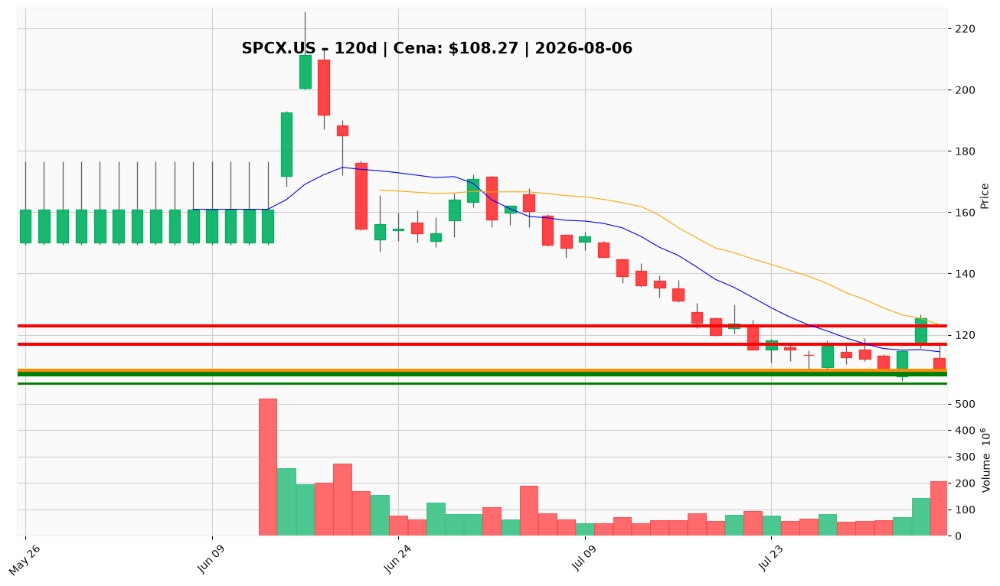

# SPCX.US — Ticket (2026-08-06)

**Werdykt:** WAIT
**Horyzont:** swing (dni–tygodnie)
**Cena ref.:** $108.27

| | Poziom | Uwagi |
|---|--------|------|
| **Wejście** | $100.00–$104.00 | limit w strefie pullbacku po stabilizacji wolumenu post-lockup; alternatywa: breakout powyżej $116 na rosnącym wolumenie |
| **Stop-loss** | $104.00 | twardy — poniżej dołka 52-tyg. ($104.83); otwiera ścieżkę bear case $98–$90 |
| **TP1** | $117.00 | zrealizuj ~50% — strefa odzyskania 10 EMA / VWMA |
| **TP2** | $123.00 | reszta — środkowa wstęga Bollingera (~14% od wejścia referencyjnego) |

**Sizing:** 0% kapitału przy obecnej cenie; po aktywacji wejścia max 0,25–0,5% kapitału (R ≤ 1 przy SL $104 od wejścia ~$102)

**Warunek aktywacji:** (1) pullback do $100–$104 z wolumenem ustabilizowanym po oknie lockup 6–8.08, lub (2) dzienne zamknięcie powyżej $116 (10 EMA / VWMA) na rosnącym wolumenie

**Unieważnienie:** Dzienne zamknięcie poniżej $104 przy rosnącym wolumenie — unieważnia tezę wsparcia $107–$108 i celuje w $98–$90 przed jakimkolwiek nowym setupem

**Dlaczego (1–2 zdania):** PM i Trader zgodnie: nie dodawać świeżego kapitału przy ~$108 po rekordowej dystrybucji (-13,6% na 206,6M akcji) i unlocku do 911,5M akcji; wsparcie $107–$108 jest obronne, ale nie potwierdzone. Asymetryczny R/R ($4 ryzyko / $9–$15 zysk) uzasadnia wejście dopiero po stabilizacji podaży lub reclaim $116.

**WERDYKT KOŃCOWY:** WAIT — pozostań poza rynkiem; ustaw alerty na strefę $100–$104 i breakout $116; nie gonić ceny w oknie lockup.

