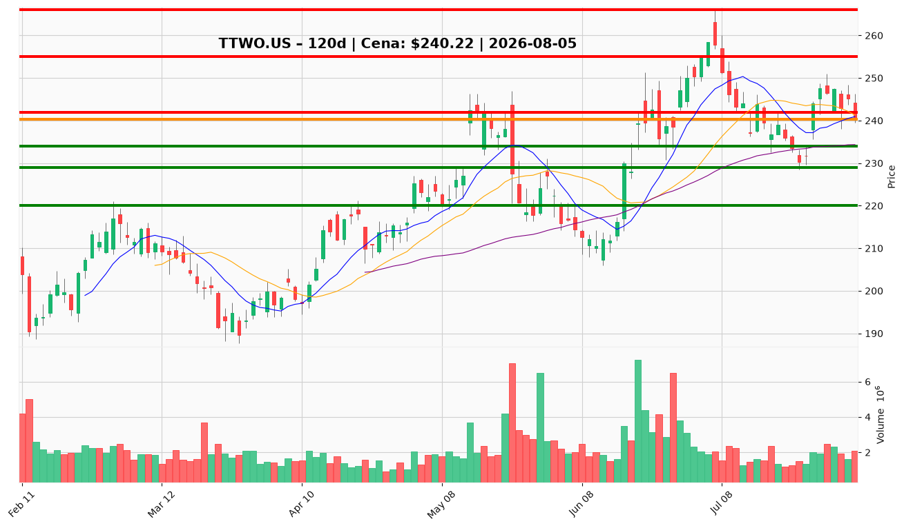

# Rekomendacje decyzyjne: TTWO.US (Take-Two Interactive)

**Data analizy:** 2026-08-05  
**Ostatnie zamknięcie:** $240,22 (2026-08-04)  
**Kontekst pozycji:** długa, wejście $253,29, dźwignia 1:5, szac. P&L ~−30%, intencja: **trzymam**

---

## 1. 📌 BŁYSKAWICZNE PODSUMOWANIE

TTWO notuje **$240,22** po korekcie ~6,3% od lipcowego szczytu $265,94 — konsolidacja w trendzie wzrostowym średnio- i długoterminowym (powyżej SMA 50: $234,34 i SMA 200: $229,60), przy osłabionej krótkoterminowej dynamice (cena poniżej EMA 10: $242,33, MACD ujemny od 24 lipca). Katalizator tygodnia: rosnąca uwaga na **GTA VI (19 listopada 2026)** i głosowanie governance **17 września**; sentyment ostrożnie konstruktywny (~3,2/5). Przy wejściu $253,29 i dźwigni 1:5 strata ~−30% odzwierciedla wysoką wrażliwość na ruchy ceny — **utrzymaj pozycję rdzeniową**, ale nie dokupuj na obecnym poziomie; ustaw twardą ramę ryzyka na $229 i czekaj na retest $234–$236 lub powrót powyżej $244 przed jakąkolwiek akcją zwiększającą ekspozycję.

---

## 2. ✅ CO ROBIĆ

▶ **TRZYMAJ** – przy cenie $238–$244 – Fundamenty (FCF ~$1,45 mld, GTA VI 19.11) i konsensus analityków (Overweight) wspierają tezę katalizatorową; Twoja intencja „trzymam” jest spójna z raportem, o ile akceptujesz ryzyko dźwigni.

▶ **USTAW STOP STRUKTURALNY** – zamknięcie dzienne poniżej **$229** przy wolumenie >2,5 mln – Poniżej SMA 200 teza średnioterminowa się psuje; przy dźwigni 1:5 spadek ~5% na akcji to potencjalnie ~25% na marży — nie odkładaj tej linii.

▶ **CELOWANIE W BREAKEVEN** – częściowa realizacja 20–30% pozycji w strefie **$252–$255** – To Twój poziom wejścia ($253,29) i pierwszy opór; odzyskanie straty na marży wymaga powrotu ceny, nie dokupu.

▶ **DOKUP (TYLKO MAŁY)** – limit $234–$236 (retest SMA 50) – Tylko jeśli masz wolną gotówkę poza depozytem zabezpieczającym i chcesz obniżyć średnią; max 10–15% obecnej wielkości pozycji, nie pełna alokacja sugerowana dla nowych inwestorów (60–75%).

▶ **MONITORUJ KALENDARZ** – przed 17 września (governance) i 19 listopada (GTA VI) – Przy negatywnym sygnale proxy (ISS/Glass Lewis) rozważ redukcję 10–15%; przy sile $255–$266 zrealizuj część zysku przed launch.

▶ **ŚLEDŹ 4 TRIPWIRE'Y** – co tydzień: (a) zamknięcie < $234, (b) plotka o opóźnieniu GTA VI, (c) sprzedaż insiderów poza 10b5-1, (d) słabość sektora gaming — dwa z czterech = redukcja 25–30%.

---

## 3. ❌ CZEGO NIE ROBIĆ

✖ **Panikowa sprzedaż na −30% marży** – Przy dźwigni 1:5 emocjonalne wyjście przy $240 realizuje stratę tuż nad wsparciem SMA 50 ($234) i SMA 200 ($229); struktura trendu nie jest jeszcze złamana.  
*Ostrzeżenie traci ważność przy:* zamknięciu dziennego < $229 na wolumenie.

✖ **Dokup na $240–$244 „żeby się odkuć”** – Średnia cena wejścia $253,29 jest powyżej rynku; dokup w konsolidacji z ujemnym MACD zwiększa ekspozycję i presję margin call bez poprawy R/R.  
*Ostrzeżenie traci ważność przy:* zamknięciu > $244 z rosnącym wolumenem i MACD dodatnim.

✖ **Ignorowanie dźwigni 1:5** – Raport zakłada ryzyko ~5% na akcji do $229; przy Twojej dźwigni to ~25% dodatkowej straty na kapitale — traktuj stop $229 jako obowiązkowy, nie opcjonalny.  
*Ostrzeżenie traci ważność przy:* pełnym spłaceniu dźwigni / przejściu na pozycję bez marży.

✖ **Trzymanie 100% przez launch bez planu wyjścia** – Ryzyko gapów (−13% styczeń, −8% maj) przy dźwigni może wymusić likwidację brokerem.  
*Ostrzeżenie traci ważność przy:* wcześniejszej redukcji 15–20% w strefie $255–$266.

✖ **Sprzedaż całości przed testem SMA 50** – Korekta z $266 do $240 to zdrowa konsolidacja po +25% rajdzie; wyjście przed $234–$236 pozbawia Cię szansy na odbicie bez zmiany fundamentów.  
*Ostrzeżenie traci ważność przy:* dwóch tripwire'ach jednocześnie lub przebiciu $229.

---

## 4. 🎯 STRATEGIA INWESTOWANIA

### Trader (horyzont: dni–tygodnie)
- **Akcja:** trzymaj; nie dokupuj powyżej $244.
- **Cel krótkoterminowy:** $252–$255 (breakeven na Twoim wejściu).
- **Stop:** $229 (zamknięcie dzienne, wolumen >2,5 mln).
- **Skalowanie:** przy powrocie > $244 z wolumenem — utrzymaj pełną pozycję; przy zejściu do $234–$236 — obserwuj odbicie, ewentualny mikro-dokup tylko przy potwierdzeniu świecy odwrócenia.

### Inwestor średnioterminowy (horyzont: 3–6 miesięcy)
- **Akcja:** trzymaj rdzeń (70–100% obecnej pozycji) do launchu GTA VI.
- **Cel:** $265–$268 (szczyt lipcowy, ~+10% od teraz, ~+5% od Twojego wejścia na akcji).
- **Trailing stop:** podnieś do $234 po zamknięciu > $255; do $242 po zamknięciu > $266.
- **Milestone'y:** 17.09 governance, marketing GTA VI Q3, pre-order data, 19.11 launch.

### Inwestor długoterminowy (horyzont: 1–3 lata)
- **Akcja:** trzymaj; rozważ obniżenie dźwigni do 1:1–1:2 po powrocie do breakeven ($253).
- **Cel:** materializacja forward EPS ~$10,03 i re-rating po launchu.
- **Ryzyka strukturalne:** opóźnienie GTA VI, rozczarowanie sprzedaży, goodwill Zynga ($4,97 mld), wzrost kosztów odsetek ($91 mln/kwartał marzec 2026).

---

## 5. 🔔 LISTA ALERTÓW CENOWYCH

### Alerty dokupu / utrzymania (górne przebicia)

| Poziom | Kwota | Typ alertu | Znaczenie |
|--------|-------|------------|-----------|
| $244 | $244,00 | BUY / UTRZYMAJ | Powrót powyżej EMA 10 + środek Bollingera — wznowienie momentum |
| $252–$255 | $253,29 | TAKE PROFIT częściowy | Twój breakeven; realizacja 20–30% pozycji |
| $265–$268 | $266,00 | TAKE PROFIT | Szczyt lipcowy; redukcja 15–20% przed launch |

### Alerty ostrzegawcze / redukcji / wyjścia (dolne przebicia)

| Poziom | Kwota | Typ alertu | Znaczenie |
|--------|-------|------------|-----------|
| $234 | $234,00 | DANGER | Test SMA 50 — pierwsza linia obrony byków |
| $229 | $229,00 | STOP LOSS | SMA 200 + dolna wstęga Bollingera — invalidacja trendu |
| $216–$220 | $218,00 | EXIT częściowy | Strefa breakoutu czerwcowego — głębsza korekta |

**TOP 2 priorytety:**
1. **Górny:** $252–$255 — częściowa realizacja przy breakeven (najważniejsze dla Twojej pozycji z wejściem $253,29).
2. **Dolny:** $229 — twardy stop strukturalny; przy dźwigni 1:5 priorytet absolutny.

---

## 6. 📊 WARUNKI ZMIANY REKOMENDACJI

### Z TRZYMAJ → DOKUP
- Zamknięcie dzienne > **$244** z wolumenem rosnącym i MACD histogram dodatni.
- Retest **$234–$236** z odbiciem (wyższe minimum, RSI > 45) bez plotek o opóźnieniu GTA VI.
- Spadek dźwigni do 1:2 lub mniej — wtedy dokup do 15% pozycji w strefie $234–$236 jest uzasadniony.

### Z TRZYMAJ → REDUKUJ / SPRZEDAJ częściowo
- Zamknięcie < **$234** przy wolumenie >2,5 mln — sprzedaj 25–30%.
- Dwa z czterech tripwire'ów (opóźnienie GTA, insider selling, sektor, < $234).
- Negatywna rekomendacja proxy na governance 17.09 — redukcja 10–15%.
- Margin call / spadek depozytu zabezpieczającego — redukcja natychmiastowa bez czekania na poziomy.

### Z TRZYMAJ → PEŁNE WYJŚCIE
- Zamknięcie dzienne < **$229** na wolumenie >2,5 mln.
- Oficjalne opóźnienie GTA VI lub istotne obniżenie forward EPS poniżej $9,50.
- Gap w dół >8% na negatywnym earnings/GTA news — wyjście przy pierwszej stabilizacji, nie „na dołku”.

---

## 7. WYKRESY TECHNICZNE

**TTWO.US – 120d | Cena: $240,22 | 2026-08-05**

Wykres zawiera:
- Świece japońskie z wolumenem
- SMA 10, 20, 50
- Poziomy wsparcia (zielone): $234, $229, $220
- Poziomy oporu (czerwone): $242, $255, $266
- Aktualna cena — linia pomarańczowa ($240,22)
- Poziom wejścia inwestora $253,29 mieści się w strefie oporu $252–$255

---

## WERDYKT KOŃCOWY

**Dla inwestora z otwartą pozycją długą (wejście $253,29, dźwignia 1:5, intencja: trzymam): TRZYMAJ z dyscypliną ryzyka.**

Raport łączy tezę katalizatorową GTA VI (Overweight / Buy etapowany) z realnymi zagrożeniami technicznymi i ryzykiem gapów. Twoja strata ~−30% na marży wynika głównie z wejścia powyżej obecnej ceny ($253,29 vs $240,22) wzmocnionego pięciokrotnie — nie z załamania fundamentów. Struktura wzrostowa (SMA 50/200) jest nienaruszona, ale krótkoterminowy momentum jest słaby.

**Plan działania:** utrzymaj rdzeń pozycji; nie dokupuj na $240; ustaw alarm na $229 (stop) i $253 (breakeven); przy powrocie do $252–$255 zrealizuj 20–30%, by odzyskać część straty i obniżyć presję dźwigni; pełne wyjście tylko przy przebiciu $229 lub potwierdzeniu opóźnienia GTA VI. Największym ryzykiem nie jest sama cena TTWO, lecz **dźwignia 1:5 w oknie binarnym do listopada** — priorytetem jest przetrwanie do katalizatora, nie agresywne „dokupywanie się”.

*Raport decyzyjny na podstawie complete_report.md z 2026-08-05. Nie stanowi porady inwestycyjnej.*
