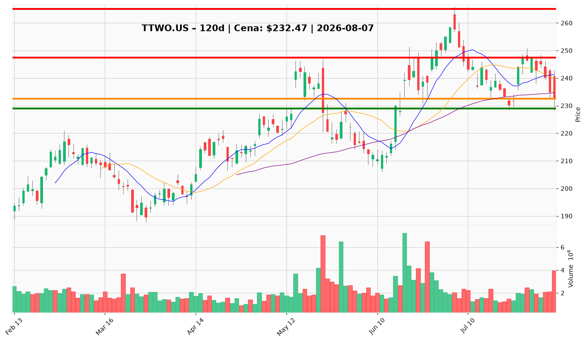

# TTWO.US — Ticket posiadacza (2026-08-07)

**Werdykt:** HOLD
**Horyzont:** swing (dni–tygodnie)
**Cena ref.:** $232.47

| | Poziom | Uwagi |
|---|--------|------|
| **Akcja teraz** | Trzymaj | Nie dokupuj przed Q1 earnings; utrzymaj pozycję |
| **Stop-loss** | $229.00 | twardy — dzienne zamknięcie poniżej |
| **TP1** | $247.50 | redukcja części (ok. 30–50%) |
| **TP2** | $265.00 | wyjście reszty przy momentum powyżej $250 |

**Sizing / skala:** Pozycja zapisana: wejście $253.29, SL $229.00, TP1 $247.50, TP2 $265.00. Nie dodawaj nowego kapitału na obecnym poziomie — ryzyko ograniczone do 1–1,5% equity portfela przez SL $229 (~1,5% od ceny ref.). Spadek z wejścia ~−8,2%; ekspozycja bez zmian przed katalizatorem.

**Warunek dokupu** (jeśli ADD): Dzienne zamknięcie powyżej $240.00 z rosnącym wolumenem po earnings + konstruktywne bookings i komentarz GTA VI — wtedy dokup na potwierdzeniu, nie na gap-and-go.

**Unieważnienie / pełne wyjście:** Dzienne zamknięcie poniżej $229.00 przy wolumenie >2,5M akcji — pełne zamknięcie longa; przełamuje swing support i 200 SMA.

**Dlaczego (1–2 zdania):** PM i Trader zgodnie: HOLD przez earnings z twardym SL $229. Wsparcie $229/200 SMA utrzymało się przy zamknięciu mimo 2× wolumenu, ale MACD bearish i dystrybucja wymagają potwierdzenia powyżej $240–$245 po katalizatorze — nie teraz.

**WERDYKT KOŃCOWY:** HOLD — trzymaj z SL $229, skaluj zyski przy $247,50 / $265; dokup tylko po potwierdzeniu post-earnings.

